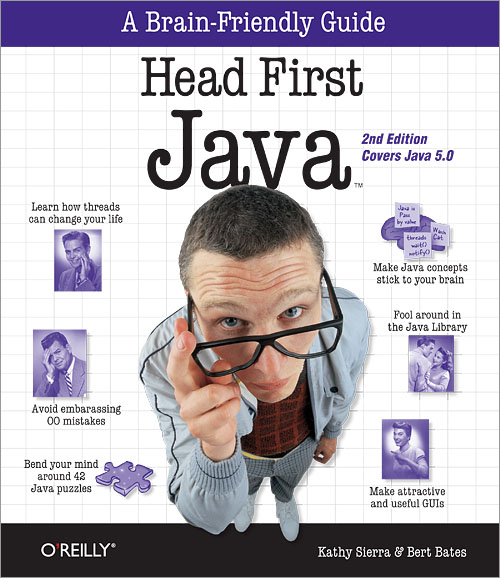
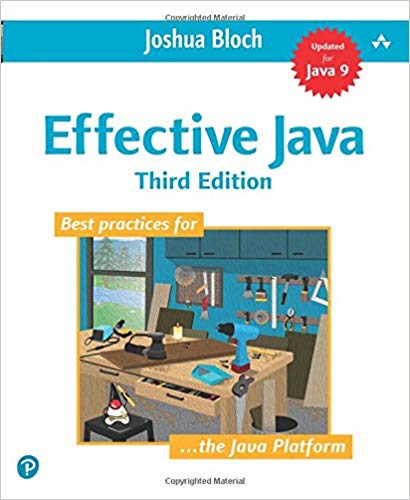
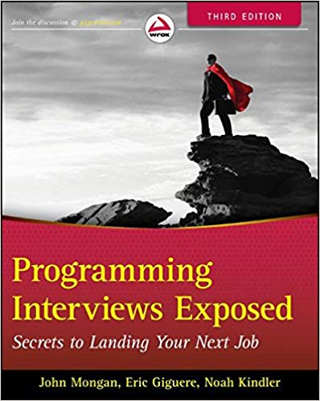

# Further reading

Споменатите материали по-долу са по-скоро препоръчилтени, а не задължителни.  
Не е задължително реда на четене/гледане на материалите да е този, в който те са описани.

**ВАЖНО:** По време на четене на книгите фокуса да не е в/у това книгата да бъде прочетена от край до край.
Следвайте съдържанието на книгата и се чувствайте свободни да пропускате глави/графи, които смятате за нерелевантни.  
Препоръчително е четененто да се извършва с конкретна цел (да науча тази тема/концепция, да попълня липсващи знания, 
да се запозная с нещо напълно ново). В следващите две видеа се засяга именно тази тема. Препоръчвам те да бъдат изгледани,
преди останалите материали.

- [How to Learn to Code - Best Resources, How to Choose a Project, and more!](https://www.youtube.com/watch?v=WKuNWrxuJ9g)

- [How to use Cracking the Coding Interview Effectively](https://www.youtube.com/watch?v=xAxgzrj8zgU)

___

### Prerequisite

- [ ] **How computers process a program:**
    - [ ] [How CPU executes a program (video)](https://www.youtube.com/watch?v=XM4lGflQFvA)
    - [ ] [How computers calculate - ALU (video)](https://youtu.be/1I5ZMmrOfnA)
    - [ ] [Registers and RAM (video)](https://youtu.be/fpnE6UAfbtU)
    - [ ] [The Central Processing Unit (CPU) (video)](https://youtu.be/FZGugFqdr60)
    - [ ] [Instructions and Programs (video)](https://youtu.be/zltgXvg6r3k)

___

### Fundamentals

Материали засягащи основите на програмирането и добри практики.

#### Books

##### [Head First Java by Kathy Sierra, Bert Bates](https://s3-ap-southeast-1.amazonaws.com/tv-prod/documents/5570-HeadFirstJava2ndEdition.pdf)

##### [Effective Java by Joshua Bloch](https://kea.nu/files/textbooks/new/Effective%20Java%20%282017%2C%20Addison-Wesley%29.pdf)

##### [Clean Code: A Handbook of Agile Software Craftsmanship (Robert C. Martin)](https://www.investigatii.md/uploads/resurse/Clean_Code.pdf)

___

### Interviews

Материали подходящи за подготовка за интервю.

#### Books

##### [Programming Interviews Exposed: Secrets to Landing Your Next Job]()

#### Videos

##### [Example Coding/Engineering Interview](https://www.youtube.com/watch?v=XKu_SEDAykw)

___

### CV Builders

#### [CV Template builder](https://www.cv-template.com/en)

#### [Canva](https://www.canva.com/create/resumes/)

#### [resume.io](https://resume.io/)

#### [Resume Coach](https://www.resumecoach.com)

___

### Ultimate Resource

Подробен списък с теми/концепции и ресурси за четене покриващи голяма част от сферата на програмирането.

#### [Coding Interview University](https://github.com/jwasham/coding-interview-university)
