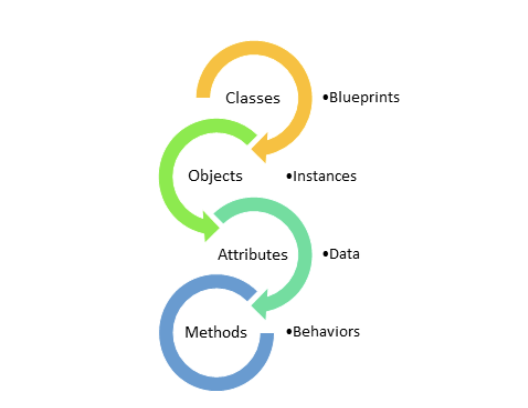
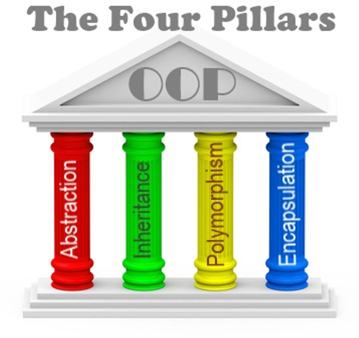

## OOP

Object oriented programing is a type of programming that allows a computer program to model real world objects.  
In programming terms this is achieved via classes, attributes and methods.

A class aims at creating a blueprint of the thing that it models. It groups together methods 
and attributes (in Java they are called properties).

For more details on OOP checkout the [OOP lecture](https://github.com/NewestUser/Java-Introduction/blob/master/lectures/bg/06-oop-introduction/Lecture6.md).

### Four pillars of OOP

There are four principles in OOP. Encapsulation, Inheritance, Polymorphism and Abstraction.
If used properly a programmer will be able to write a well-structured and maintainable system.

#### Encapsulation

A software project tends to grow larger over time.
The addition of new features adds more complexity which needs to be tackled and maintained by developers.
Encapsulation is one of the principles that can help minimize the complexity of a system if used properly.
It can reduce the [coupling](https://en.wikipedia.org/wiki/Coupling_(computer_programming)) between parts of the system. 
This makes the system more flexible and it is easier to introduce changes.

For more details on Encapsulation checkout the [lecture on Encapsulation](https://github.com/NewestUser/Java-Introduction/blob/master/lectures/bg/08-access-modifiers/Lecture8.md).

#### Inheritance

Inheritance is a programming mechanism of basing a class upon another class. 
Using inheritance we can achieve a form of code reuse. Also, using inheritance we can create models of objects
that share a common class hierarchy.

For more details on Inheritance checkout the [lecture on Inheritance](https://github.com/NewestUser/Java-Introduction/blob/master/lectures/bg/09-inheritance/Lecture9.md).

#### Abstraction

Abstraction is a principle tha can help reduce the complexity of a system. We can say that by using abstraction we can create
a multi layered system. Each layer focuses on dealing with its internals and at best not leaking any of the 
inner workings into the other layers, thus abstracting them from the details. 
Again using abstraction we can design systems that are highly decoupled and flexible.

You can find abstractions everywhere in the everyday wife. One example is the radio. You just turn on a dial and the music starts playing. 
The dial abstracts us away from what exactly happens inorder for the sound to be played. You don't need to know what voltage to apply on the electrical components.
How to tune for the correct radio frequency etc... 

For more details on Abstraction checkout the [lecture on Abstraction](https://github.com/NewestUser/Java-Introduction/blob/master/lectures/bg/11-abstraction/Lecture11.md).

### Polymorphism

Polymorphism is an object-oriented programming concept that refers to the ability of a variable, function or object to take on multiple forms.
This is a powerful feature that allows for building a highly flexible code base.

For more details on Polymorphism checkout the [lecture on Polymorphism](https://github.com/NewestUser/Java-Introduction/blob/master/lectures/bg/11-abstraction/Lecture11.md).

#### Task 1
Write a program that simulates a grocery shop. 🛒

The shop has two main functionalities. To stock up goods and to sell goods.

The task is divided into several sub tasks.
Each subtask depends on the previous one.

The task has to be solved iteratively task by task.
Each subtask enforces the need to make changes into the previous subtasks.
The purpose of the task is to solve a problem that is constantly evolving. This simulating some of the challenges faced
when introducing features in a real project. 

##### 1.1

- A Shop can be stocked up with products.
    - When a product is added in the shop by its name productName and price.

- The shop can be used to sell products. When a product is sold the shop issues a purchase receipt. 
    - A product is sold by its name and the amount of money that the customer gives.
    - Upn successful purchase the shop issues a purchase receipt consisting of:
        - the name of the product which is purchased
        - the price of the product
        - change (difference between the amount of money given by the customer and the price of the product)
    - A product can be sold only when:
        - the requested product is available (needs to be in stock)
        - the amount of money is enough to pay for the product
    - If the product can't be purchased then a receipt is not issued.
    - When a product is sold it is no longer available until it is stocked up again.
    

##### 1.2

- Introduce the concept of quantity when stocking up a product. The quantity is a whole positive number.
    - Example: When stocking up with 2 bananas the shop can sell 1 banana twice.
    
- It should be possible to stock up the same product multiple times.
    - Example: Stock up twice with 2 apples. After this 4 apples can be sold.
    - If the shop stocks up a second time with a product that is already available but is with a different price
    then the new product should be treated as a product with a separate price.
        - Example: the shop stocks up with 1 banana with the price of 3lv, then another banana is added 
        to the shop this time with the price of 5lv, then the shop has 1 banana for 3lv and 1 banana for 5 lv.
        - In this case it does not matter which banana will be sold first. 
        
##### 1.3

- When purchasing a product it should be possible to state what is the quantity that is being purchased.
    - When purchasing 2 bananas for 3lv then the client needs to pay 6lv in total.
    - After purchasing 2 out of 2 available bananas it shouldn't be possible to sell more bananas until a stock up.
    - The purchase receipt should contain the purchased product quantity.
    - If the customer requests more items than what is available then nothing will be sold.

##### 1.4

- It should be possible to stock up a product with a promotional 2 for 1 price.
    - Example: Assuming the shop is stocked up with 2 chocolate with a promo price 2 for 1 where a single chocolate costs 5lv. It should be possible
    to sell 2 chocolates for 5lv.
    - This type of product (2 for 1) can be purchased only if the requested quantity is 2, 4, 6 etc...
        - If there are 4 chocolates with this promotion it shouldn't be possible to sell 3, 5 or 7 chocolates.

##### 1.5

- It should be possible to stock up a product with a promotional 3 for 2 price.
    - Example: the shop is stocked up with cookies with the promo price 3 for 2. If a single package of cookies costs 5lv 
    it should be possible to buy 3 packages for 10lv.
    - This type of product can be sold only if the requested quantity is 3, 6, 9 etc...
        - If the shop has 3 packages it should not be possible to sell 2 or 5 packages.
