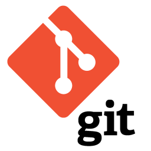
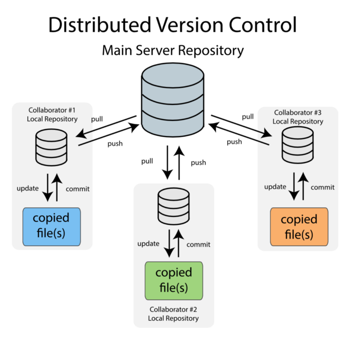

## Version Control

A software project's source requires management of its own. Often projects have their own lifecycles that include regular releases,
bug fixes, maintaining and fixing vulnerabilities in old versions, synchronizing between multiple people working on the same code base etc...

Stuff like this enforces the need of a **Version Control System (VCS)**.

> Version control systems are a category of software tools that help a software team manage changes  
to source code over time. Version control software keeps track of every modification to the code in  
a special kind of database. If a mistake is made, developers can turn back the clock and compare earlier 
versions of the code to help fix the mistake while minimizing disruption to all team members.  
Such systems are also mentioned as __Revision Control__ or __Source Control__ Systems.

There are different VCS out there like [Mercurial](https://www.mercurial-scm.org/), [SVN](https://subversion.apache.org/), [Git](https://git-scm.com/) etc...  
For the purpose of this course we will use Git as it is most commonly used nowadays.

### Git

Git is a distributed open source version control system. With it we can keep track of different version of our code base
and have multiple people work on it at the same time. 

