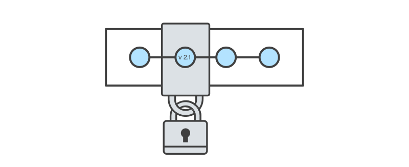
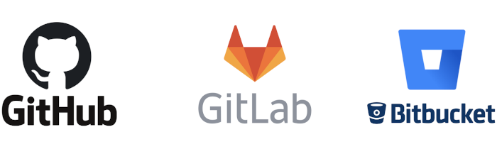
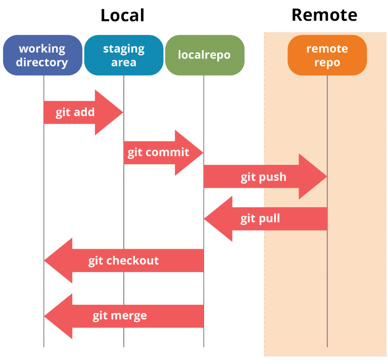
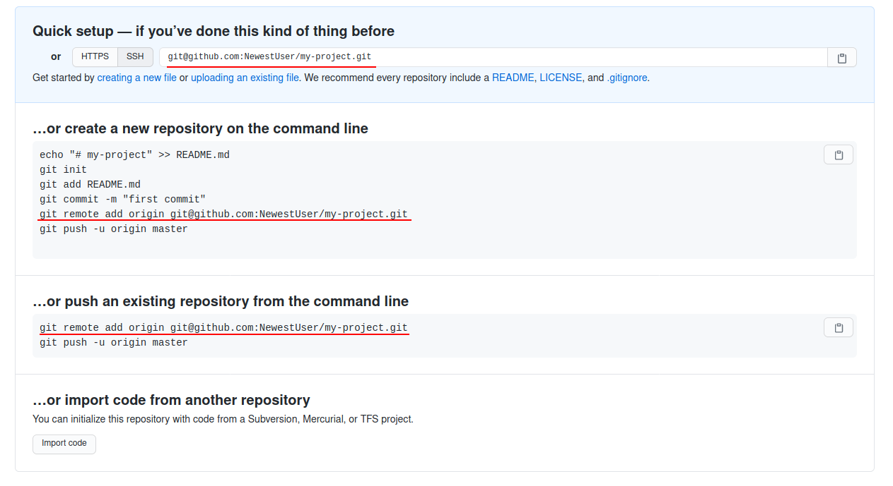

## Version Control



A software project's source requires management of its own. Often projects have their own lifecycles that include regular releases,
bug fixes, maintaining and fixing vulnerabilities in old versions, synchronizing between multiple people working on the same code base etc...

Stuff like this enforces the need of a **Version Control System (VCS)**.

> Version control systems are a category of software tools that help a software team manage changes  
to source code over time. Version control software keeps track of every modification to the code in  
a special kind of database. If a mistake is made, developers can turn back the clock and compare earlier 
versions of the code to help fix the mistake while minimizing disruption to all team members.  
Such systems are also mentioned as __Revision Control__ or __Source Control__ Systems.

There are different VCS out there like [Mercurial](https://www.mercurial-scm.org/), [SVN](https://subversion.apache.org/), [Git](https://git-scm.com/) etc...  
For the purpose of this course we will use Git as it is most commonly used nowadays.

#### Git Installation

You can find the instructions on how to install Git for your OS on the [Official Git Download Page](https://git-scm.com/downloads).
The rest of the lecture will contain examples using the git command line client.   
**Linux and OS X users** can run the commands in a normal terminal after installing git.  
**Important for Windows Users**: When running the installation wizard make sure you chose to install **Git BASH**.
Git BASH is an emulator of an [Unix Shell](https://en.wikipedia.org/wiki/Bash_(Unix_shell)) 
and will allow you to run unix and git commands in it.

### Git


Git is a distributed open source version control system. With it we can keep track of different version of our code base
and have multiple people work on it at the same time. 


In order for us to work efficiently with Git we must set a common understanding of a few terms.

### Remote Repository

The remote repository is the centralized place where the different versions of the code is stored. It serves the purpose 
of a backup, and a place where multiple contributors can sync their work.  
**Note:** The remote repository is a kind of service which provides the mentioned functionality plus some additional features
like code reviews, forking projects etc...

Some examples for Remote repositories are:



> Hint: A remote repository can be created from the UI of these services.
After creation the repository can be cloned locally.  
Example : `git clone https://github.com/git/git`

### Local Repository

The local repository is usually a full clone of the remote repository. This allows for a developer to keep a local copy 
of the project which includes all the codebase versions. Having such a repository locally allows the contributor to work 
without the need of internet access and at the same time create new versions of the code.  
**Note:** A local repository does not require a remote repository. A git project can be developed only locally. However 
having a remote repository can add an extra layer of safety as it can at least serve as an additional backup.

> Hint: A local git repository can be created from the command line with `git init`.

### Git workflow

In order to benefit from git one must understand its workflow.  
As we sed git is a versioning tool. This means that the developer can decide at any point in time 
to take a snapshot of the code base. We call this snapshot a **commit**. 
The commit can contain changes for a single or multiple files.

The process for creating a consists of several steps. The steps are illustrated on the diagram bellow as:
- working directory
- staging area
- localrepo



**Let's work through an example for better clarity.**

#### 0. Configuring the git client.

The first time we install git we need to configure it. In git each commit has an author and email.
Here is how we can configure this:

```
git config --global user.name "Marian Zlatev"
git config --global user.email "marian.zlatev@mail.com"
```

#### 1. Creating local git repository and committing in it.

```shell script
# create a project directory
mkdir my-project

# navigate into the project dir
cd my-project

# initialize local git repository
git init
```

Up until now we have created a directory for our project and initialized the git repository.
In order to demonstrate the workflow we will **create a new file** add it to the **staging area** and **commit** it.

```shell script
# make git print the status of the empty working directory 
git status

# create file
touch file.txt

# make git print the status of the working directory this time containing changes
git status

# add these changes to the staging area
git add --all

# make git print the status of the working directory and see that there file.txt is ready to be committed
git status

# commit the staged file.txt and add a message
git commit -m "add empty file"

# see the commit that was just created
git log

# make git print the status of the again empty working directory
git status
```

Now we have created a file and committed that file, going through the different steps.
We saw how the status of the repository changes with each step.

#### 2. Pushing the commit to a remote repository.

In order to push the changes to a remote repository first we need to link our local repository with the remote one.
After creating the project from the UI of the chosen service you will be prompted to add a **remote**. 
Here is how this looks in **Github**, other services are similar.



```shell script
# add remote named origin pointing to the project 
git remote add origin git@github.com:<MyUserName>/<MyProjectName>.git
```
This will create a **remote** (the link) named **origin** that will point to the remote repository. 

> The name origin is by convention.

If we have initially created the project from the remote service UI we would have to clone the project.
If you haven't done this you can skip this step.

```shell script
git clone git@github.com:<MyUserName>/<MyProjectName>.git
```

Now that we have the remote repository we can push the commit.

```
git push origin master
```

You can make sure that the change is present on the remote repository by exploring the UI. 

#### 3. Git branching

As we said multiple people can work on the same codebase. This is usually achieved by creating a branch for each person.
Such branches are called feature branches. The feature branch is created from the master branch. This is the branch that
contains the latest version of the codebase. After creating the copy the developer starts working on that branch by
introducing new commits in it. Other developers are free to do the same on their branches.  
You can see this illustrated on the diagram bellow.  
After the desired change is complete the feature branch is merged back into the master branch. 
This way the master branch keeps evolvoing.  


**Example**:

```shell script
# create a new branch
git checkout -b my-feature-branch

# introduce changes into the new branch
git commit -m "commit some changes on the feature branch"

# go back to the master branch
git checkout master

# merge the feature branch into the master branch
git merge my-feature-branch

# push the changes to the remote repository (all the steps above were done in the local repo)
git push origin master
```

ℹ️ For an additional in depth tutorial you can checkout the official 
[Getting Started Docs](https://git-scm.com/book/en/v2/Git-Basics-Getting-a-Git-Repository).


## Tasks

### Task 1
Create a git project and create and resolve a merge conflict.
A merge conflict occurs when two branches have changed the same file and are merged together.

**HINT**: Create an empty file and commit it in the master branch. Create a new branch B1 from master.
Change the contents of the file and commit it in B1. Create a second branch B2 again from the master branch.
Change the contents of the file and commit it in B2. Merge B1 into master. Merge B2 into master and observe the conflict.