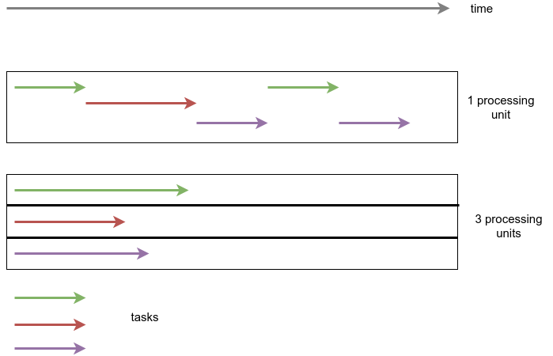
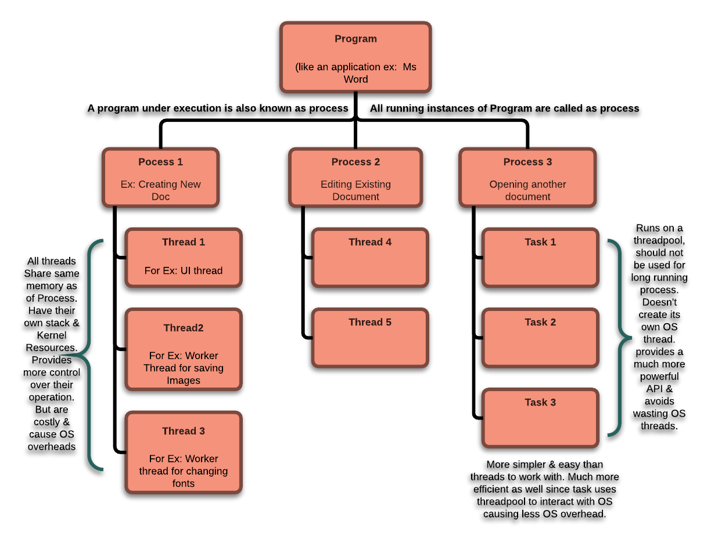
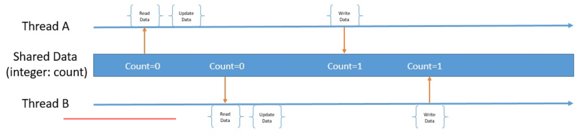

## Multithreading and Concurrency Fundamentals

### Concurrency

Nowadays we use computers to do multiple things at once. We browse the web while listening to music, write text documents
while downloading files etc...

If we have a single core CPU we only get to execute a single instruction at any given point in time. At the same time we are able
to run multiple programs and have the feeling that everything is happening at once. This would not have been possible 
if the system was not **concurrent**.  
To have a system that is concurrent means that the system is capable of doing multiple things (not necessarily at once).


### Context Switching

What ends up happening is that the CPU gets a small portion of time to execute instructions of a given task, after which 
it moves on to executing instructions on the next task and so on. This is called **context switching**. 
Thanks to context switching the system is capable of multitasking. 
This creates the illusion that multiple tasks (processes) are executed at the same time.

However, context switching has some overhead. If the CPU is to be switched to work on another task the state of the current 
task needs to be saved, and the state of the next task loaded. This allows for resuming the previous task when the time comes.    
The task's state is actually the **context**. It consists of the CPU's registers and program counter at any point in time.  

You can see this illustrated in the diagram bellow. 


> ℹ️ For mor details on how a computer executes instructions watch this [youtube video](https://www.youtube.com/watch?v=XM4lGflQFvA).

### Parallelism

Modern computers include CPUs that have multiple cores. This allows tasks to be executed simultaneously (in parallel).

Often the terms concurrency and parallelism get mixed and sometimes are used interchangeable. However, it is important
to point out that there is a subtle difference between the two.

**Concurrency is about dealing with lots of things at once. Parallelism is about doing lots of things at once.**

A well-designed concurrent system can have components that can be executed in parallel.  



It also makes sense to mention here that adding multiple CPU cores can speedup the execution of the program however there
is a theoretical limit that can be reached after which the number of cores does not matter. This is also known as the
[Amdahl's Law](https://en.wikipedia.org/wiki/Amdahl%27s_law).

**Mothers giving birth are a good example.**  
A pregnant woman can give birth to a child in 9 months. Adding 8 more women won't result in a child being born in 1 month.
It can result in 9 children being born but the minimum time required is 9 months. If a speedup is required the process of 
giving birth needs to be broken down into something that can be further parallelized.

## Threads

Up until now we have talked about executing tasks on the CPU. It is important to note that there is a difference between
a **process**, a **thread**, and a **task**.

To put it simply a process is a program that is being executed. A process can have multiple threads and multiple threads can be reused
in order to execute tasks on them. Sometimes you can see these terms used interchangeably but in most cases they are used
to differentiate between something that is doing the work and something that needs to get done.

The diagram below tries to illustrate this.



In principle the thread in a single threaded process is the actual process. 
However, there are cases where a process (program) might need to do multiple things at once. 
This is where threads actually come into play, and we would need more than on of them.

User Interfaces (UI) are always a good example for this.
When you open a web browser and type in a URL and hit enter two things happen. 
A request for the web page is made, and the UI continues to be responsive. 
Those things can easily be done on two separate threads. 
If they were executed on a single thread then we wouldn't be able to click anything on the UI until the web 
page finishes loading. 

You can think of processes and threads as units that can be used to get work done. 
Tasks on the other hand can be though of as the actual work. We feed or schedule tasks on the threads.

It is important to note that threads share the same memory (address space) within a process 
while processes do not share memory between them self.

This is one of the reasons context switching between processes includes more overhead than context switching between threads.  

> ℹ️ For more details checkout this [article](https://www.geeksforgeeks.org/difference-between-thread-context-switch-and-process-context-switch/).

### The thread scheduling & pooling

There are generally more threads than CPUs. Part of a multithreaded system is therefore a thread scheduler, 
responsible for sharing out the available CPUs in some way among the competing threads.


Different OS's have different schedulers and can implement scheduling using different algorithms. There are also different
approaches for scheduling as **cooperative**, **preemptive** and a mix of the two.

The diagram below illustrates a thread's lifecycle.


On the other hand a single process can spawn multiple threads. This requires system calls to the OS which in
turn requires allocation of more resources. Each thread has its own stack, set of registers and program counter.  
Programs often try to minimize system calls and unnecessary memory allocation. Thus threads end up being reused.  
This is called **Thread Pooling**. 
Using this technique we don't eliminate the problem of having more things to do than available threads. 
Rather, we reduce the overhead created from spawning new ones. At the same time we shouldn't spawn threads carelessly,
as more threads introduce more overhead for scheduling and memory management. 
So having more things to do and not enough workers to do it enforces the need of a Task Queue which can serve as a buffer.


#### Additional Learning resources

If you wan a more in depth explanation on thread scheduling checkout:
 - [How Threads Work: more details](https://www.javamex.com/tutorials/threads/how_threads_work.shtml) 
 - [Cooperative vs. Preemptive: a quest to maximize concurrency power](https://medium.com/traveloka-engineering/cooperative-vs-preemptive-a-quest-to-maximize-concurrency-power-3b10c5a920fe)
 - [Threads](https://www.cs.uic.edu/~jbell/CourseNotes/OperatingSystems/4_Threads.html)
 - [Basic Thread Management](https://pages.mtu.edu/~shene/NSF-3/e-Book/FUNDAMENTALS/thread-management.html)
 - [Concurrency and Multithreading - Introduction (video)](https://www.youtube.com/watch?v=mTGdtC9f4EU)

## Java Threads

Java exposes a set of tools that allow for developing multithreaded applications.
When a Java application is started its `main()` method gets executed from the **main thread** that is created by the JVM.
That thread can spawn multiple other threads. Threads have a parent-child relationship so that when the parent thread
terminates all the child threads terminate as well.

In Java, we can create a thread by creating an instance of the class `Thread` which can also be extended.

```java
Thread thread = new Thread();
thread.start();
```

It is pointless to create threads without delegating any work to them.
There are a few ways we can do this.

- Extending a thread

```java
class GreetingThread extends Thread {

    @Override
    public void run() {
        System.out.println("Hello Multi Threading");
    }
}

GreetingThread thread = new GreetingThread();
thread.start();
```

- Implementing the `Runnable` interface

```java
class Greeting implements Runnable {
    @Override
    public void run() {
        System.out.println("Hello Multi Threading");
    }
}

Thread thread = new Thread(new Greeting());
thread.start();
```

> A common mistake is to invoke the `run` method of the thread instead of `start`. By invoking `start` the code
will get executed on the new thread. If you instead invoke `run` the code will still 
get executed but on the current thread.

#### Example single thread vs multiple threads

The code below does 10 iterations while sleeping for 1 second in each.  
In total the execution time takes around 10 seconds because the same thread is put to sleep for 1 second.

```java
for (int i = 0; i < 10; i++) {
    try {
        System.out.println("Sleeping for 1000 ms");
        Thread.sleep(1000);
    } catch (InterruptedException e) {
        e.printStackTrace();
    }
}
```

The code below performs the sleep inside a separate thread. 
In total the execution time is around 1 second.

```java
for (int i = 0; i < 10; i++) {
    new Thread(new Sleeper()).start();
}

...

class Sleeper implements Runnable {
    @Override
    public void run() {
        try {
            System.out.println("Sleeping for 1000 ms");
            Thread.sleep(1000);
        } catch (InterruptedException e) {
            e.printStackTrace();
        }
    }
}
```


### Synchronization

Let us look at an example that uses multiple threads to increment a shared counter.

```java
public class Main {
    static int counter = 0;

    public static void main(String[] args) throws InterruptedException {
        for (int i = 0; i < 100; i++) {
            new Thread(new Runnable() {
                @Override
                public void run() {
                    try {
                        // we simulate some delay in an attempt to reproduce context switching
                        Thread.sleep(10);
                    } catch (InterruptedException e) {
                        e.printStackTrace();
                    }
                    counter++; // the troublemaker
                }
            }).start();
        }

        // we wait a bit to guarantee that all the threads have finished before reading the value
        Thread.sleep(1000);
        System.out.println(counter);
    }
}
```
> The code starts 100 threads that increment the value of `counter`.

If you run this code several times you might notice that the end result is not always 1000.
This is due to the fact that `counter++` is not an **atomic operation**. By an atomic operation we mean
an operation that guarantees that there will be no interference by other threads/processes while it is being performed.  
Usually those operations involve reading and writing from memory, disk, network etc...

> In the example above we make the thread sleep before performing the operation. 
This simulates a more real world scenario where the actual computation of the thread requires more time.
If the sleep was absent it would be harder to simulate the problem as we might end up depending on the scheduler 
and on the way this code gets executed (whether on 1 core or multiple or if there will be context switching or not).  

Let us examine more closely `counter++`. In order for this operation to be performed we need to:
1. read the value of counter from memory
2. increment the value
3. write the value back to memory

`counter++` does not guarantee that while thread **A** performs the operation another thread **B**
 can't also step in before thread **A** finishes. You can see this illustrated in the diagram below.
 


In order to fix this problem we need to guarantee a **[happens before relationship](https://en.wikipedia.org/wiki/Happened-before)**.
Or in other words we must guarantee that the writing of thread **A** happens before the reading of thread **B**.  
You can see this illustrated in the diagram below.


### Synchronized & Synchronized Blocks

Java comes with a build in synchronization mechanism that if used properly can guarantee a *happens before relationship*.

One such example is the **synchronized block**. Let's apply it to the counter example above.

```java
public class Main {
    static int counter = 0;
    static final Object object = new Object(); // we synchronize on this instance

    public static void main(String[] args) throws InterruptedException {
        for (int i = 0; i < 100; i++) {
            new Thread(new Runnable() {
                @Override
                public void run() {
                    try {
                        // we simulate some delay in an attempt to reproduce context switching
                        Thread.sleep(10);
                    } catch (InterruptedException e) {
                        e.printStackTrace();
                    }
                    synchronized (object) {
                        counter++; // this block is synchronized
                    }
                }
            }).start();
        }

        // we wait a bit to guarantee that all the threads have finished before reading the value
        Thread.sleep(1000);
        System.out.println(counter);
    }
}
```

The code here uses a synchronized block on the `counter++`. This enforces that peace of code to be executed 
sequentially between multiple threads.

> **Important:** The synchronized block can be used to enforce mutual exclusion of threads in a **critical section** of the code.  
It is important to keep this block small and not to include areas that might not need synchronization.
This approach can sometimes be tricky and failing to implement it properly can undermine the synchronization attempts.
Common pitfalls are synchronizing on **non final fields**, synchronizing on new instance like `synchronized (new Object())`.  
For a more in depth explanation you can read about the 
[Java Memory Model and the Double Checked Locking Problem](https://www.cs.umd.edu/~pugh/java/memoryModel/jsr-133-faq.html).

Java also supports synchronizing entire methods. Here is a slightly different version of the 
counter example using a **synchronized method**. 

```java
public class Main {
    static int counter = 0;

    public static void main(String[] args) throws InterruptedException {
        for (int i = 0; i < 100; i++) {
            new Thread(new Runnable() {
                @Override
                public void run() {
                    try {
                        // we simulate some delay in an attempt to reproduce context switching
                        Thread.sleep(10);
                    } catch (InterruptedException e) {
                        e.printStackTrace();
                    }
                    increment();
                }
            }).start();
        }

        // we wait a bit to guarantee that all the threads have finished before reading the value
        Thread.sleep(1000);
        System.out.println(counter);
    }

    // This method is synchronized
    private static synchronized void increment() {
        counter++;
    }
}
```

> Note that here the `synchronized` keyword is placed on a static method. 
This means that at any given point in time only one thread will be able to invoke the static method. 
If it was placed on a method belonging ot an instance then the synchronization applies for that instance.

An important thing to note here is how synchronized methods and blocks like `synchronized(object) {...}` work. 
The synchronized block accepts an instance parameter of any kind. This is the instance variable that will be 
used to synchronize the multiple threads. If `synchronized` is placed on a method then synchronization 
is performed either on the instance of the class, or the whole class. This would depend on whether the method
is static or not. To make things more clear we must mention how **Monitors** work.

### Monitors

A [monitor](https://en.wikipedia.org/wiki/Monitor_(synchronization)) is a mechanism to control concurrent access to an object. 
It allows threads to have [mutual exclusion](https://en.wikipedia.org/wiki/Mutual_exclusion). 
Often such a mechanism is referenced as a **mutex** or **lock**.  
At any given point in time only one thread is allowed to acquire the lock. Any other threads that also try to 
acquire the lock must wait until it is released.

In java each object has an associated monitor with it. This means that this monitor can be used to synchronize 
critical sections of the code.

In the example below we use the monitor of the variable `myObject` to synchronize concurrent access.

```java
class Main {
    private static final Object myObject = new Object();

    public void foo() {
        synchronized (myObject) {
            // critical section
        }
    }
}
```

### wait & notify

You might have already noticed that every object in Java has the methods `wait`, `notify` and `notifyAll`.
These methods can be used to communicate between multiple threads.
One use-case would be to have thread A wait for thread B to compute something, after which thread A can proceed with 
the computed result from thread B.
All the methods need to be invoked on an object which the monitor has been or will be acquired. Or in other words they 
need to be invoked on the instance that the synchronization is being performed on.

- **wait()** - Causes the current thread to wait until `notify` or `notifyAll` gets called.
As a rule of thumb waiting needs to be performed in a loop that checks a condition if the thread
should continue to wait or proceed with the data it has waited for.

- **notify** - This method can be used to notify a single thread that is already waiting on the object's monitor.
There might be multiple threads waiting on the monitor. Which thread will actually be woken up depends on the underlying scheduler.
We as programmers do not have control over this.

- **notifyAll** - This method can be used to notify all threads that are waiting on the object's monitor.

Java also provides concurrency utilities that make the usage of `wait`, `notify` and `notifyAll` 
irrelevant as they can be tricky to implement correctly. 
You should prefer the high level constructs provided by `java.util.concurrent.*` released in Java 5;

For a code example of wait and notify you can checkout 
[Importance of wait(), notify() and notifyAll() methods in Java?](https://www.tutorialspoint.com/importance-of-wait-notify-and-notifyall-methods-in-java).


### Volatile

Another synchronization primitive that Java provides is the keyword `volatile`. 
While the volatile modifier performs no mutual exclusion, it guarantees that any thread that reads the field will
see the most recently written value.

CPUs are equipped with caches that allow variables to be read from main memory and written to the cache for fast access.  


This performance improvement can cause problems when a variable is shared between multiple CPUs.
Imagine that both **CPU1** and **CPU2** share the same variable. **CPU1** performs a *read* and *write* and **CPU2** performs only *reads*. 
If **CPU1** first *reads* after which *writes* the value but instead of flushing the value back to **main memory** it is stored in the CPU cache
then **CPU2** won't be able to observe the *write* of **CPU1** and would *read* a stale value.


The `volatile` keyword guarantees that all reads and writes are performed using main memory. This guarantees that threads
will always observe the latest value. However, this does not guarantee that if multiple threads perform *reads* and *writes*
those operations will be synchronized. Between the time one CPU reads the value and performs a write another thread might have already
read the same value and committed the write to main memory. This is called a **race condition**. In those scenarios we still need
to perform synchronization. 

> ℹ️ For a more detailed explanation on how volatile works
checkout [Java Volatile Keyword](http://tutorials.jenkov.com/java-concurrency/volatile.html).

### Immutability

One design pattern that is worth mentioning while talking about concurrent programming is **Immutability**.
Without going into any details, immutability implies that an object can't change it's state after it is instantiated.
The reason we mention this design pattern is that immutability is inherently thread safe, they require no synchronization.
If we can guarantee that an object's state can't be changed then there is no problem sharing the object between multiple threads
as they will only be able to read the state without modifying it. 

> ℹ️ For an example on how to create an immutable class checkout 
[A Strategy for Defining Immutable Objects](https://docs.oracle.com/javase/tutorial/essential/concurrency/imstrat.html).

### Atomic and Thread Safe classes

Java provides a set of classes that can safely be shared between multiple threads without the need of external synchronization.
Some examples include:

- AtomicBoolean
- AtomicInteger
- AtomicLong
- AtomicIntegerArray
- ConcurrentHashMap
- BlockingQueue
- BlockingDeque
- etc...

Here is an example of the counter updated by multiple threads synchronized with an `AtomicInteger`.

```java
import java.util.concurrent.atomic.AtomicInteger;

public class Main {
    static AtomicInteger counter = new AtomicInteger(0);

    public static void main(String[] args) throws InterruptedException {
        for (int i = 0; i < 100; i++) {
            new Thread(new Runnable() {
                @Override
                public void run() {
                    try {
                        // we simulate some delay in an attempt to reproduce context switching
                        Thread.sleep(10);
                    } catch (InterruptedException e) {
                        e.printStackTrace();
                    }
                    counter.incrementAndGet();
                }
            }).start();
        }

        // we wait a bit to guarantee that all the threads have finished before reading the value
        Thread.sleep(1000);
        System.out.println(counter.get());
    }
}
```

### ReentrantLock

Sometimes we might need to implement our own data structures that are thread safe. In those cases we can leverage
the high level concurrency constructs provided by java.
One such example is the `Lock` or one of its implementations `ReentrantLock`.

Let us implement our own `AtomicCounter`.

```java
public class AtomicCounter {
    private final Lock lock = new ReentrantLock();
    private int count;

    public int incrementAndGet() {
        lock.lock();
        try {
            return ++count;
        } finally {
            lock.unlock();
        }
    }

    public int get() {
        lock.lock();
        try {
            return count;
        } finally {
            lock.unlock();
        }
    }
}
```

In the example above we use a `ReentrantLock` to guarantee that at any given point in time only one thread can read and write.
`lock.lock()` acquires the lock and if another thread tries to invoke the `lock` method it will have to wait until the lock is released.
Note that unlocking is done in a `finally` block. This guarantees that if an exception is thrown while performing the operation
the lock will be unlocked. If we fail to unlock it any other threads that are waiting on the lock will remain blocked.  
The reentrant part of the lock is not demonstrated in this example. Basically it consists of the ability of a thread to invoke the
`lock` method multiple times without blocking on itself.

Another thing that is worth mentioning on the example above is that reading and writing share the sam lock.  
This can cause performance issues in the case where we have more readers than writers. 
Imagine a case where writes are performed once every second and reads are performed thousands of times per second.
In those cases it makes sense to lock reads only when writes are performed and vice versa. 
This on itself can introduce more issues. We would need to have control over which waiting thread should continue waiting
and which should acquire the lock. If we fail to do so, we might end up with a 
[starvation](http://tutorials.jenkov.com/java-concurrency/starvation-and-fairness.html) problem. 
We would not have any guarantee that the writing thread will be able to commit it's write because there are multiple reading threads
hogging up the CPU. Java however comes with a `ReadWriteLock` lock suited for such cases.

> ℹ️ For a more detailed on how a ReadWriteLock works checkout 
[Read/Write Locks in Java](http://tutorials.jenkov.com/java-concurrency/read-write-locks.html).


- synchronized & synchronization blocks
- monitors
- happens before relationship
- race conditions
- await && notify
- volatile
- atomicity
- immutability
- reentrant lock

- semaphore

#### Additional Learning resources

- [Creating and Starting Java Threads](http://tutorials.jenkov.com/java-concurrency/creating-and-starting-threads.html)