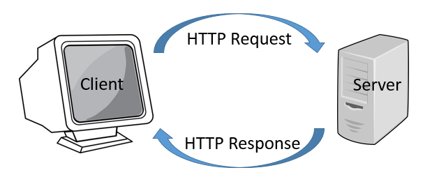
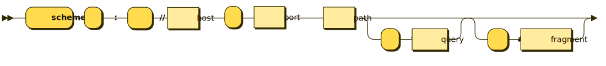

## Hypertext Transfer Protocol (HTTP)

Nowadays communication is in the center of everything.
Most of the applications that we use on an everyday basis get stuff done by collaborating with
other applications often located on different networks. This imposes the need of having a 
reliable communication mechanism that can be used to exchange messages between systems/applications.

There is a variety of commonly used protocols each with its own specifics and use cases. 
Also in networking it is common for one protocol to encapsulate information from another protocol.
The **Open Systems Interconnection model (OSI model)** is a conceptual model characterising the communication
functions of a networking system. It is broken down into 7 layers. Where each layer encapsulates the 
details of the one beneath it.


> An easy mnemonic to remember the OSI Model is **P**lease **D**o **N**ot **T**hrow **S**alami **P**izza **A**way. 

**HTTP** sits on the 7th layer from the OSI model and is build on top of **TCP/IP**.
TCP on itself is a protocol that establishes a reliable streamed manner for transferring data. Thus, HTTP inherits 
these characteristics. 

> ℹ️ For more details on networking watch these [youtube videos](https://www.youtube.com/playlist?list=PLowKtXNTBypH19whXTVoG3oKSuOcw_XeW).

As of this time of writing there are two major versions of the HTTP protocol.
[HTTP/1](https://en.wikipedia.org/wiki/Hypertext_Transfer_Protocol),
[HTTP/2](https://en.wikipedia.org/wiki/HTTP/2) and even 
[HTTP/3](https://en.wikipedia.org/wiki/HTTP/3) (which is still in a draft state). 


HTTP is a request-response communication protocol which involves two parties a **client** and a **server**. 
The client is the one issuing the **HTTP Request**. This can be for an example a web browser requesting an HTML page from a web server. 
The server is responsible for accepting the request issued by the client acting upon it and returning an **HTTP Response**.



An HTTP Request consists of:

- Method
- URL
- Headers
- Body (optional)

An HTTP Response consists of:

- Headers
- Body (optional)
- Status Code

### Request URL

A client issuing an HTTP request needs to provide a URL which servers to identify the receiver of the request and the resource being requested. 



- **schema** - used to identify how the resource will be accessed, in this case http.
- **host** - identifies the receiving machine, it can be a hostname or ip address.
- **port** - used to identify which process on the host machine will receive the request, by default http uses port 80.
- **path** - used to identify a resource within the application that has accepted the request.
- **query params** - optional parameters that can be passed in the url.
- **fragment** - an optional parameter used as a secondary resource identifier.

Example:

```
https://www.youtube.com/watch?v=OYjZK_6i37M&ab_channel=GodsmackVEVO
```

- **schema** - https
- **host** - www.youtube.com
- **path** - watch
- **param with value** - v=OYjZK_6i37
- **param with value** - ab_channel=GodsmackVEVO

### Request Method

Each HTTP Requests contains an HTTP method. The method is used to express the intent of the request. 
For example: **GET** **https://www.youtube.com**.  
Sometimes the HTTP method is referred to as a verb.

Here is a list of HTTP methods:
- **GET**
- **HEAD**
- **POST**
- **PUT**
- **DELETE**
- **CONNECT**
- **OPTIONS**
- **TRACE**
- **PATCH**

> ℹ️ You can find some of them documented in [RFC 2616](https://www.w3.org/Protocols/rfc2616/rfc2616-sec9.html).

Some methods are absent of an HTTP Request Body like **GET**, **HEAD**, **DELETE**, **TRACE**.

The most frequently used methods are **GET** and **POST**.

**GET** should be used when a client is requesting information from the server. The client can pass parameters to the 
server via the URL and HTTP headers.

**POST** can be used in cases where the client needs to pass data to the server that is not applicable for the URL or 
HTTP headers the client can use an HTTP POST method. Such cases can include uploading a file, submitting HTTP forms, 
passing data between two servers etc... In most cases POST is used when the client wants to create a new entry/resource 
on the server.

### Request/Response Body

The body is the main means of transferring data between the client and the server. Both the client request and the server response
can contain a body. Unlike the http headers and URL which are limited the body allows for much larger amounts of data to be transferred.

### Request/Response Headers

The HTTP headers are an additional mechanism for transferring meta information between the client and the server.
These are key-value pairs. Some of them are standardized and mandatory but an application is free to define custom headers.
For example when transferring an HTTP body the headers `Content-Lenght` and `Content-Type` can be used to indicate the 
size of the body and the type of the data. 

### Response Status Code

Each HTTP response contains a numerical status code that can be used to identify whether the request has been processed 
successfully by the server, or some kind of error has occurred. 

The status codes are separated into several groups.

##### Informational **1xx** 
These status codes indicate a provisional response.

##### Successful **2xx**
These status codes are used to indicate that the request of the client has been successfully processed.

##### Redirection **3xx**
These status codes are used to indicate that the client may need to perform another action inorder to fulfil the initial request.

##### Client Error **4xx**
These status codes indicate cases where the client has erred.

##### Server Error **5xx**
These status codes are returned when the server is aware that is has errered. In those cases the server is unable to fulfil the request.  

> ℹ️ For a detailed explanation of each of the status codes checkout [RFC 2616](https://www.w3.org/Protocols/rfc2616/rfc2616-sec10.html).


## HTTPS overview 

The **S** in HTTPS stands for **secure**. HTTPS uses TLS (or SSL) to encrypt the data transferred by the two parties. 
This way HTTPS solves the following problems: 


> ℹ️ If you want to learn more about what makes HTTPS a secure protocol watch this youtube video:
 [What is CA](https://www.youtube.com/watch?v=T4Df5_cojAs&ab_channel=kubucation)

### TODO

- CIA triad (https://www.coursera.org/lecture/cybersecurity-roles-processes-operating-system-security/confidentiality-integrity-and-availability-CJmiA)

- HTTPS
- DNS
