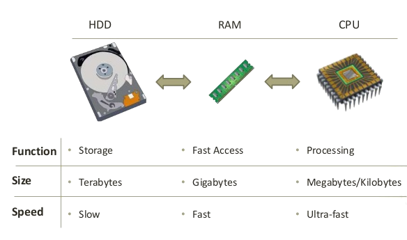
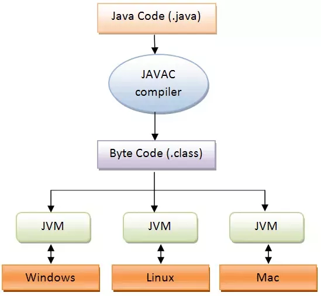

# Lecture 1
#java course#

## Introduction

### How does the human brain work?

The human brain is divided into areas where each area has a concrete purpose.  
For example the [prefrontal cortex][prefrontal-cortex] is responsible for focusing on tasks 
and serves as a short term memory.  
Another area called [hippocampus][hippocampus] is in charge of memories and 
serves as a long term memory.  
The [temporal lobe][temporal-lobe] is involved in processing sensory input. 
We use the temporal lobe along with the *prefrontal cortex* and other areas of the brain to solve math problems.


> Did you know that the *[amygdala][amygdala]* is responsible for regulating emotions, fear, anxiety?  
[Alex Honnold][alex-honnold] he is considered the most fearless free solo climber. He owns a big part of his success  
to his malfunctioning *amygdala*.  
The *amygdala* is also often responsible for the fear in students wanting to ask a question.

[prefrontal-cortex]: https://en.wikipedia.org/wiki/Prefrontal_cortex
[hippocampus]: https://en.wikipedia.org/wiki/Hippocampus
[temporal-lobe]: https://en.wikipedia.org/wiki/Temporal_lobe
[amygdala]: https://en.wikipedia.org/wiki/Amygdala
[alex-honnold]: http://nautil.us/issue/39/sport/the-strange-brain-of-the-worlds-greatest-solo-climber

### How does a computer work?

Similar to a [human brain](#how-does-the-human-brain-work) the computer also has dedicated parts responsible for memory 
and computation. It also has several memory units. *Short term (RAM)* and *long term (HDD)* memory.
The computations or the so called instructions are processed by the *processor (CPU)*.



> When we write programs we will save them on *HDD*, when we run the program 
it will be loaded in *RAM* and will be processed by the *CPU*.

## What is Java?

Java is a high level programming language. This means that we as programmers don't have to think about details like 
what is the CPU of the machine that the program will run on, what is the operating system etc...


> [James Gosling][james-gosling] created Java in 1995.  
Java is actually an island on which coffee trees are planted.

[james-gosling]: http://www.computinghistory.org.uk/det/1793/James-Gosling/


### What is Java composed of?

The programming language Java can be thought of as a collection of tools/technologies.

- JDK (Java Development Kit) - the JDK provides the necessary tools for programmers to write Java programs 
which can then be ran via the JRE and JVM.

- JRE (Java Runtime Environment) - the JRE is a collection of libraries which will be used during the execution of the program. 
The JRE also includes the JVM.

- JVM (Java Virtual Machine) - the JVM is the component that executes the program.


### How does a Java program get executed?

The programs that we write are nothing more than text files with a `.java` extension. 
In order for these files to be executed by the computer they first need to be translated into a low level language the processor understands.
This happens in several steps.

1. The text files `.java` are translated (compiled) by the `compiler` into `bytecode`. The resulting `bytecode` translations are actually files with a `.class` extension.
2. Получените `.class` файлове биват зареждани от `JVM` за изпълнение
3. `JVM` изпълнява `bytecode` като го превежда на език разбираем за конкретна операционна система и конкретен процесор



#### Какво друго трябва да знаем за Java?

###### Java е мултиплатформена
Това означава че една и съща програма може да бъде изпълнявана на различни операционни системи,
като Windows, Linux, Mac и тнт...

###### Трябва ли ми JDK за да мога да изпълня Java програма
Не е задължително на един компютър да има инсталирано `JDK` за да може да се изпълни една Java програма.
Една програма може да бъде написана и компилирана на компютър с `JDK` и да бъде изпълнена на друг,
който има само `JRE`.

###### Java е обектно ориентиран език
Това означава че езикът има способността да моделира предмети от реалния свят. (За това ще говорим в следващите лекции).

###### Java e типизиран език
Това означава че всяко едно нещо, което може да бъде моделирано от езика има конкретен тип.
Пример за типове са числа, текст, дати и тнт...


## Примитивни типове (Primitive types)

В езикът Java има заложени типове данни, които репрезентират различни неща. Пример за такива **primitive** типове са:
*символ*, *цяло число*, *дробно число* и други.  

Примитивните типове данни са в основата на езика, като те се използват и ще бъдат използвани от нас за изграждането 
на по сложни типове данни. Един такъв пример е *текстът*, той е изграден от много на брой *символи*.

### Типове числа

Числата може да ги разглеждаме като два основни вида. Цели числа като `1`, `-5` , `367` както и 
дробни числа `3.14159`, `2.718`, `-332.97`. Всеки един от двата вида се дели на числа с
конкретен размер (максимална и минимална стойност).

- Числа (Numbers)

    - Цели числа (Whole numbers)
        - `byte`  8 bit = -128…127
        - `short` 16 bit = -32 768….32 767
        - `int` 32 bit = -2 147 483 648…2 147 483 647
        - `long` 64 bit = -2^63…2^63 - 1 
        
    - Дробни числа (Decimal numbers)
        - `float` 32 bit = -3.4E+38…3.4E+38
        - `double` 64 bit = -1.7E+308…1.7E+308
        
### Типове символи

- Символ (Symbol)

    - `char` 16 bit unicode character = *a*,    *$*,    *4* 

### Булев тип

- Boolean
    - `boolean` = true/false


## Променливи (Variables)

Чрез тези типовете данни, ние можем да създаваме **променливи**.
Всяка една променлива има **тип**, **име** и **стойност**.  
Може да си представите това, като кутия с различна форма. Формата на кутията е **типът (type)**,
Съдържанието на кутията е **стойността (value)**, а цялата кутия е **променлива (variable)**, понеже съдържанието
в кутията може да се сменя.
Също така си представете че има много на брой кутии, които си приличат. За да може да ги различаваме ще трябва да им 
дадем **име (name)**.


- Пример

    ```java
    int year = 2019;
    
    double pi = 3.14;

    boolean isMale = true;
  
    char dollar = '$';
    ```
    
#### Аритметични оператори

- `+` —  събиране (addition)
- `-` — изваждане (subtraction)
- `*` — умножение (multiplication)
- `/` — деление (division)
- `%` — деление с остатък (modulo)

#### Логически оператори

- `!`  - отрицание (logical NOT)
- `&&` — логическо И (logical AND)
- `||` — логическо ИЛИ (logical OR)

#### Оператори за сравнение

- `==` - оператор за равенство (equal)
- `!=` - различно (not equal) 
- `>` - по-голямо (greater than)
- `>=` - по-голямо или равно (greater than or equal)
- `<` - по-малко (less than)
- `>=` - по-малко или равно (less than or equal)

## Hello World

Първата ни Java програма, ще изпише на конзолата `Hello World`. Целта на тази програма е да илюстрира синтаксиса на 
езика.

```java
public class Main {
    
    public static void main(String[] args) {
      
        System.out.println("Hello World");
    }
}
```

> Знаете ли че първата *[Hello World][hello-world]* програма е написана през 1972г. на езикът [B][b-language]

[hello-world]: https://en.wikipedia.org/wiki/%22Hello,_World!%22_program
[b-language]: https://en.wikipedia.org/wiki/B_(programming_language)

## Hello ...

Целта на втората ни задача е да напишем програма, която поздравява с това, което е въведено от потребителя.  
Пример: потребителя въвежда `Alise`, а програмата изписва `Hello Alise`

```java
import java.util.Scanner; // описваме кое средство ще използваме за вземане на данни от клавиатурата

public class Main2 {

    public static void main(String[] args) {
        Scanner myScanner = new Scanner(System.in); // създаваме средството чрез което ще вземаме данни от клавиатурата и го кръщаваме myScanner

        String input = myScanner.nextLine(); // използваме myScanner за да вземем данни от клавиатурата и ги записваме в променливата input

        System.out.println("Hello " + input); // принтираме слято Hello и въведената стойност от потребителя
    }
}
```

> Забележете програмата е написана във втори файл с име `Main2`.  
Когато стартирайте програмата въведете име от клавиатурата, след което натиснете enter. 

ℹ️ За повече информация относно типовете данни изгледайте това [youtube видео](https://www.youtube.com/watch?v=TBWX97e1E9g&list=PLE7E8B7F4856C9B19)
и това [youtube видео](https://www.youtube.com/watch?v=yYN8u90MKCg&list=PLE7E8B7F4856C9B19&index=2).