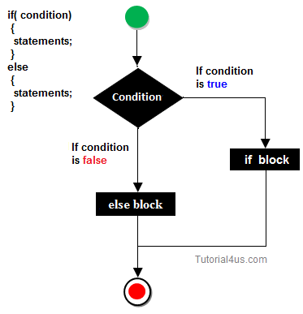

# Lecture 2
#java course#

## if/else statements

The order in which individual statements/instructions are executed in a program can vary depending on different **conditions**.
This is called **Control flow**.
For example: the program can execute different instructions depending on the input of the user.
While the program is running these conditions are evaluated. Then a decision is made on with which code branch/path the execution should continue.


> Example program execution. Regardless of any conditions the program starts from **1**. 
Depending on the conditions in the different nodes the program execution can go down different branches.
The program can finish in either **5**, **7** or **9**.

### if

One of the ways code branches can be created is by using an `if` statement.
Example:

```java
if (condition) {
    // if block
}
```

> The brackets `(...)` must contain a condition that can be evaluated to a **boolean**. If the condition is **true** the body of the if statement (**if block**) is executed.
If the condition is **false** then the **if block** is skipped, and the execution continues after the if statement.

###### Example

```java
if (true) {
    System.out.println("This will always execute");
}
``` 

```java
boolean myCondition = ...;

if (myCondition) {
    System.out.println("This will execute only if myCondition == true");
}
```

```java
int a = ...;

if (a == 5) {
    System.out.println("This will execute if a == 5");
}
```

```java
int a = ...;
int b = ...;

if (a != 5 && b >= 10) {
    System.out.println("This will execute only if a differs from 5 and b >= 10");
}
```

### else

Often we need to check a condition and if it is not met then execute something else.
This can be achieved by using the `else` operator.

Here is an example:

```java
boolean myCondition = ...;

if (myCondition) {
    // if block
} else {
    // else block
}
``` 
> If `condition` is **false**, then the **else block** will be executed skipping the **if block**.

**IMPORTANT:** There cannot be an `else` without an `if`.

###### Example

```java
int age = ...;

if (age >= 18) {
    System.out.println("He is equal or over 18");
} else {
    System.out.println("He is under 18");
}
```

Often similar conditions can be illustrated with the following diagram:



### else if

Sometimes an `if` condition and all other cases `else` are not enough to build the logic of an application.
Often we need to execute a peace of code found between multiple conditions.

For this reason we can use an `else if` operator.

Example:

```java
boolean condition = ...;
boolean otherCondition = ...;

if (condition) { // execute only if condition is true
    // if block
} else if (otherCondition) { // execute only if otherCondition is true and condition is false
    // else if block
}
```

> In this example we have two conditions. The order in which they evaluated is from top to bottom.
First the value of *condition* is checked. If it is `true` then the **if block** will be executed.
If the value of *condition* is `false` then the next condition will be checked. If *otherCondition*
is `true` then the **else if block** will be executed. If it is `false` then none of the if blocks will be executed.

Again it is possible to add an `else` clause at the end. This will cover all cases outside of the conditions.

```java
boolean condition = false;
boolean otherCondition = false;

if (condition) {
    // if block
} else if (otherCondition) {
    // else if block
} else {
    // else block
}
```

> In this example the **else block** will be executed.

### nested if
 
Sometimes multiple conditions need to be met in order to execute a certain functionality.
In such cases we can use a **nested if**.

```java
int b = ...;

if (b > 5) {
    if (b < 10) {
        System.out.println("The value of b is between 5 and 10");
    }
}
```

This same example can be written using a logical operator **AND** `&&`.

```java
int b = ...;

if (b > 5 && b < 10) {
    System.out.println("The value of b is between 5 and 10");
}
```

### Logical operators

- `!` - inversion

|**X**  |**!X** |
|-------|-------|
|true   |false  |
|false  |true   |

- `&&` — logical AND

|**X**  |**Y**  |**X && Y** |
|-------|-------|-----------|
|true   |true   |true       |
|true   |false  |false      |
|false  |true   |false      |
|false  |false  |false      |

- `||` — logical OR

|**X**  |**Y**  |**X &#124;&#124; Y**   |
|-------|-------|-----------------------|
|true   |true   |true                   |
|true   |false  |true                   |
|false  |true   |true                   |
|false  |false  |false                  |

### Comparison operators

- `==` - equal
- `!=` - not equal 
- `>` - greater than
- `>=` - greater than or equal
- `<` - less than
- `>=` - less than or equal


### Switch Case


**if else** is not the only control flow operator in Java.
The language offers another control flow mechanism for achieving the same goal called **switch case**.  

```java
int z = 2;
        
switch (z) {
    case 1:
        System.out.println("z = 1");
        break;
    case 2:
        System.out.println("z = 2");
        break;
    case -8:
        System.out.println("-8");
        break;
    default:
        System.out.println("z не е 1, 2 или -8");
        break;
}
```
> This example will print `z = 2`.

The way the switch-case statement works is that the conditions (case statements) depend on the value that is passed to the `switch(...)` operator.
Depending on the value of the variable in the **switch** a decision is made which **case** should be evaluated.
It is important to note that each **case** ends with a `break`. This will end the execution of the entire switch-case and the program will continue after the statement. 
If a `break` is missing then the program will continue executing the next **case** block regardless if it is met or not.  
Try it out by removing the `break` in `case 2:`.  
The switch-case operator also has an equivalent to the **else** operator in the **if** statement. This equivelent is the keyword **default**.

Here is how the example above would look like written using an **if** statement.

```java
int z = 2;

if (z == 1) {
    System.out.println("z = 1");
} else if (z == 2) {
    System.out.println("z = 2");
} else if (z == -8) {
    System.out.println("z = -8");
} else {
    System.out.println("z не е 1, 2 или -8");
}
``` 

Preferring an **if else** or **switch case** statement is a subjective decision. Usually **switch case** is preferred
when a decision needs to be between a definitive number of constant possibilities.  
Example: is a person male or female (the constant here is the gender).

## Loops

It is often required a program to perform a set of instructions multiple times.
This can be achieved by using loops. In Java there are three kinds of loops `for`, `while` and `do while`.
The loops differ in syntax but aim to solve the same problem. That is to repeat a set of steps until a **condition** stops being met. 

### for

Probably the most frequently used loop is the **for** loop. It is composed of several components 
**initializing part**, **condition**, **body** and **step**. Semicolons separate each part excluding the body.

```java
for ( /* initializing part */ ; /* condition */ ; /* step */ ) {
    /* body */
}
```

- **Initializing part** used to define the starting point of the loop.
 Usually in it we define a variable with an initial value, example: `int i = 0`
 
- **Condition** is checked on each iteration in order to decide whether to execute the body. 
Ако условието е `true` тялото на цикъла се изпълнява, ако е `false` се прекратява изпълнението на цикъла и се продължава с кода след цикъла. 

- **Body** is the part we want to repeat, it contains the instructions that will be repeated multiple times.

- **Step** is the last part of the **for** loop, in it we usually execute an action that will eventually lead the evaluation of the condition to `false` and thus ending the loop.
After the step is executed the program loops back into checking the condition.


> This image illustrates the order of execution of a **for** loop. 
The example is written in C#, but the principles apply to most programming languages.

###### Java Example

```java
for (int i = 0; i < 10; i++) {
    System.out.println(i);
}
```

> This code will print the numbers from 0 to 9 including.

### while

**while** loop differs from the **for** loop in that it only has a **condition**. Usually the **initializing part** 
is located outside of the loop (or an initializing part might not be required). The **step** is inside the **body** of the loop. 

###### Пример

```java
int i = 0; // initialize the variable i i

while (i < 10) { // loop condition
    System.out.println(i); // action
    i++; // step
}
```

> This code will print the numbers from 0 to 9 including.

### do while

**do while** differs from the other loops in that the body of the loop will get 
executed at least once before the condition is checked.

###### Example

```java
int i = 0;

do {
    System.out.println(i);
    i++;
} while (i < 10);
```

> This code will print the numbers from 0 to 9 including.


Here is an example higlighting the difference between a **while** and a **do while** loop.

```java
boolean condition = false;

while (condition) {
    System.out.println("hello");
}
```

> The program won't print anything because the condition which is `false` is checked first.

```java
boolean condition = false;

do {
    System.out.println("hello");
} while (condition);
```

> The program will print `hello` once because the body is executed first after which the condition is checked.
