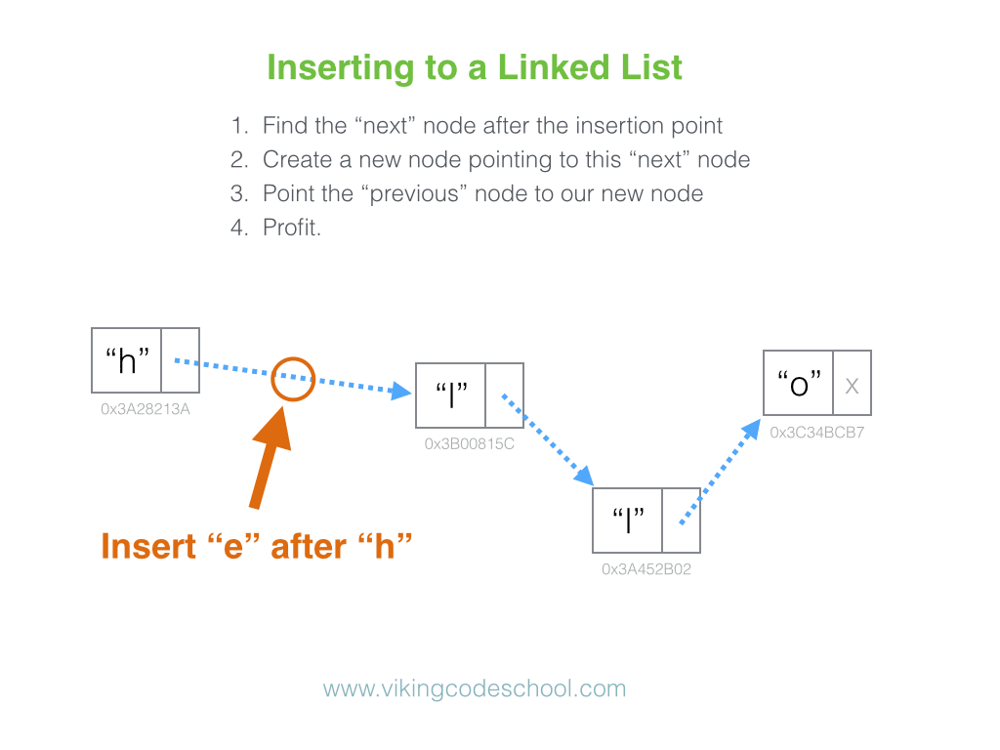
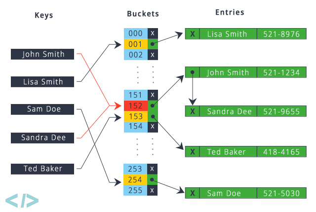

# Lecture 12
#java course#

## Collections

### Data structures

Often when developing programs it is required some information to be stored by the program.

For example if we have to write an online horse raising platform which needs to keep track of:
- Which city on which date has a raise.
- Which are the jockeys in each race.
- How many races has each of the jockeys won, etc...

Such data can be stored or kept in a variety of data structures.

Each data structure has its own specifics, advantages and disadvantages. Choosing the right one
would depend on the type of operations that would need to be performed on the data.

For example, we might often add new horse races in compare with adding new cities.
We might need to search for jockeys that are ordered by the number of won races.

In this lecture we will discuss some fundamental data structures and how they are implemented in Java. 

> ℹ️ For more information about what are data structures watch this
[youtube video](https://www.youtube.com/watch?v=bum_19loj9A).


#### Arrays

Arrays are one of the simplest data structures.
They represent a sequence of elements with a fixed size. 
Each element can be accessed using an index.


- Pros
    - Constant `O(1)` access time to an element using an index.
    - The array can hold multiple elements.
    
- Cons
    - The data structure is static. Meaning we can't add more elements than the size of the array.
    - We need to know the size of the array before we create it.

> The array is often used as a building block for more complicated data structures.

#### List

The List is a data structure that is similar to an array but can be dynamically expanded.

Using a list we do not need to know the initial size of the list. We can add elements to the list, and it will take care
of automatically resizing if needed. 

In Java a `List` is an interface, which has multiple implementations. In this lecture we will have a look at some of them.

##### ArrayList

`ArrayList` is an implementation of the `List` interface. This is a dynamic list, which uses an array under the hoods.
When the underlying array gets full, and a new element needs to be added the `ArrayList` will take care of creating a new
array with larger size, copying the elements from the old array to the new array and add the element.

The array also has a `size` which represents the number of elements that are added.
This is the number **4** in the diagram below. At the same time there is an internal property `capacity`. The capacity
is the actual size of the underlying array. It is not required that the `size` equals to the `capacity`. The difference
between `capacity` and `size` serves as a buffer. When `capacity` equals `size` the underlying array needs to increase in size.

.

> ℹ️ For more information checkout this [youtube video](https://www.youtube.com/watch?v=qTb1sZX74K0).

- Pros
    - We do not need to know the size of the ArrayList before we create it.
    - Fast access to elements using an index.
    - Elements can be added to the end of the array without any overhead.
    
- Cons
    - Adding elements in the beginning or the middle of the array requires the elements on the right to be shifted.
    - When the size reaches the capacity a new array with a larger size needs to be created. 
    The elements from the old array need to be copied into the new array.

**Example**

```java
List<String> myArrayList = new ArrayList<>();

myArrayList.add("foo");
myArrayList.add("bar");
myArrayList.add("zar");
myArrayList.add("var");
myArrayList.add("far");

myArrayList.remove("bar");  // find the element "bar" and remove it
myArrayList.remove(1);      // remove the element located on index 1

for (String myString : myArrayList) {
    System.out.println(myString);
}
```

##### LinkedList



> ℹ️ For more information watch this [youtube video](https://www.youtube.com/watch?v=_jQhALI4ujg).

**Example**

```java
List<String> myLinkedList = new LinkedList<>();

myLinkedList.add("foo");
myLinkedList.add("bar");
myLinkedList.add("zar");
myLinkedList.add("var");
myLinkedList.add("far");

myLinkedList.remove("bar"); // find the element "bar" and remove it
myLinkedList.remove(1);     // remove the element located on index 1

for (String myString : myLinkedList) {
    System.out.println(myString);
}
```

#### Stack


**Example**

```java
Stack<String> myStack = new Stack<>();

myStack.push("foo");
myStack.push("bar");
myStack.push("zar");
myStack.push("var");
myStack.push("far");

String lastElement = myStack.pop(); // remove last pushed element

System.out.println("Last element: " + lastElement);

for (String myString : myStack) {
    System.out.println(myString);
}
```

#### Queue


> ℹ️ For more information watch this [youtube video](https://www.youtube.com/watch?v=wjI1WNcIntg)

**Example**

```java
Queue<String> myQueue = new LinkedList<>();

myQueue.add("foo");
myQueue.add("bar");
myQueue.add("zar");
myQueue.add("var");
myQueue.add("far");

String lastElement = myQueue.poll();    // remove first element

System.out.println("First element: " + lastElement);

for (String myString : myQueue) {
    System.out.println(myString);
}
```

#### Trees 

##### TreeSet


> ℹ️ For a more in depth explanation of what exactly happens when an element is added or removed from an array watch this 
[youtube video](https://www.youtube.com/watch?v=oSWTXtMglKE).

**Example**

```java
TreeSet<String> myTree = new TreeSet<>();

myTree.add("foo");
myTree.add("bar");
myTree.add("zar");
myTree.add("var");
myTree.add("far");

myTree.remove("bar"); // find and remove the elment bar

for (String myString : myTree) {
    System.out.println(myString); // iterate them sorted
}
```

#### Set

##### HashSet


> ℹ️ For more information read [this article](https://www.thecshandbook.com/hash_set)
or watch this [youtube video](https://www.youtube.com/watch?v=WPcKwA5WF7s).

**Example**

```java
Set<Integer> mySet = new HashSet<>();

mySet.put(12);
mySet.put(20);
mySet.put(30);
mySet.put(30);
mySet.put(-15);

mySet.remove(20);

for (Integer number : mySet) {
    System.out.println(number); // iterate them in unspecified order
}
```

#### Hash Tables

##### HashMap



> ℹ️ For a detailed explanation on how Hash Tables work watch [this](https://www.youtube.com/watch?v=MfhjkfocRR0) 
and [this](https://www.youtube.com/watch?v=shs0KM3wKv8) youtube video.

**Example**

```java
Map<String, Integer> myMap = new HashMap<>();

myMap.put("foo", 1);
myMap.put("bar", 3);
myMap.put("zar", -4);
myMap.put("var", 8);
myMap.put("far", 12);

myMap.remove("bar"); // find and remove bar

for (String myKey : myMap.keySet()) { // iterate all keys in unspecified order
    System.out.println(myKey);
}

for (int myValue : myMap.values()) { // iterate all values in unspecified order
    System.out.println(myValue);
}
```

##### Collections vs Maps

Both collections and maps represnet different data structures. 
However, their class hierarchy is separate.


#### Iterators

One common thing between all the data structures that we went through is that they can be iterated. 

Java provides the interface `Iterator` which expresses the ability to iterate over a group of objects.

Here you can see the `Iterator` interface before Java 8.

```java
public interface Iterator<E> {
    
    boolean hasNext();
    
    E next();
     
    void remove();
}
```

> One useful use case of the iterator is when we want to remove elements while iterating.
This can prove difficult to implement with a `for` loop.


All the data structures from the Collection hierarchy have a method `Iterator<E> iterator();` which returns an iterator.
Using it we can loop through the data structure.

The methods of the iterator provide the following functionality.

- `hasNext()` - check if there is a next element

- `next()` - return the next element

- `remove()` - remove the current element (the one on which the iterator is currently located at)

**Example**

```java
List<String> myList = ...;

Iterator<String> myListIterator = myList.iterator();

while (myListIterator.hasNext()) {   
    String currentElement = myListIterator.next();
    
    if ("removeMe".equals(currentElement)) {
       myListIterator.remove(); 
    }
}
```

> Since Java 8 a few more methods have been added to the Iterator interface which are not of grate importance for the scope of this lecture.


#### Compare to

Often when working with a given data type we would need to store the data in a sorted order.
For example if we have a list of numbers we might want to store those numbers in ascending or descending order.
This would allow for faster searches.

Ordering numbers or text is intuitive (text can be order alphabetically). 
Ordering elements that model real life objects is not. For this reason we need a clear definition on how to compare two 
complex objects of the same type.

Let's look at an example where we need to keep an ordered list of people. Before ordering the list we need to define
what will be used to compare two people. We might choose to compare people by age or height or eye color or 
all of the properties.

Here is where the `Comparable` interface comes in. We can use it to give this definition.

```java
public interface Comparable<T> {

    int compareTo(T other);

}
```

The interface has only 1 method `compareTo`, which accepts as an argument the element that will be used to compare against.
The method has an `int` return type. The class implementing this method is required to return **-1**, **0** or **+1** 
depending on if the current item is **less than**, **equal to** or **grater than** respectively.

**Example**

```java
class Person implements Comparable<Person> {
    
    private int age;
    
    public Person(int age) {
        this.age = age;
    }
    
    @Override
    public int compareTo(Person other) {
        if (this.age < other.age){
            return -1;
        }
        
        if (this.age == other.age){
            return 0;
        }
        
        return 1;
    }
}
```


## Tasks

### Task 1

Write a program that accepts unlimited number of user inputs. The user should input floating-point numbers.
The program should stop when the user enters `-1`. Before stopping the program should print all the numbers 
entered by the user in reverse order and also print the smallest of the numbers. 

- Example

```text
Enter number: 32
Enter number: -8
Enter number: 12
Enter number: 0.5
Enter number: -1

Result: 0.5 12.0 -8.0 32.0 
Smallest number: -8.0
```

> Hint: Use `List<Integer> numbers = new ArrayList<>();` to solve the task.

<br/><details><summary><b>Solution</b> 👀</summary> 
<p>

- Task1.java

```java
import java.util.ArrayList;
import java.util.List;
import java.util.Scanner;

public class Task1 {

    private static final double STOP_NUMBER = -1;

    public static void main(String[] args) {
        Scanner scanner = new Scanner(System.in);

        List<Double> myNumbers = new ArrayList<>();

        double min = STOP_NUMBER;

        while (true) {
            System.out.print("Enter number: ");
            double currentNum = scanner.nextDouble();

            if (currentNum == STOP_NUMBER) {
                break;
            }

            if (min == STOP_NUMBER) {
                min = currentNum;
            } else if (min > currentNum) {
                min = currentNum;
            }

            myNumbers.add(currentNum);
        }

        System.out.printf("%nResult: ");
        for (int i = myNumbers.size() - 1; i >= 0; i--) {
            double element = myNumbers.get(i);

            System.out.print(element + " ");
        }

        System.out.printf("%nSmallest number: " + min);
    }
}
```

</p>
</details>

### Task 2

Write a program that prints the unique words entered by a user.
The user can enter single words or whole sentences.
Every program should print a message every time the user enters a word that was previously entered.

The program should stop when the user enters `stop`. Before stopping the program should print all unique words 
entered by the user. The order of printing is not important.

- Example
  
```text
Enter text: football
Enter text: glass
Enter text: pour wine
Enter text: love wine
The word 'wine' is already entered.
Enter text: glass
The word 'glass' is already entered.
Enter text: stop

Unique words: football glass love pour wine
```

> Hint: Use `Set<String> words = new HashSet<>();` to store the unique words.
You can use `String[] words = text.split(" ");` to retrieve all the words in a sentence
 assuming they are separated only by whitespace.

<br/><details><summary><b>Solution</b> 👀</summary> 
<p>

- Task2

```java
import java.util.HashSet;
import java.util.Scanner;
import java.util.Set;

public class Task2 {

    public static void main(String[] args) {
        Scanner scanner = new Scanner(System.in);

        Set<String> uniqueWords = new HashSet<>();

        boolean shouldPromptUser = true;
        while (shouldPromptUser) {

            System.out.print("Enter text:");
            String sentence = scanner.nextLine();

            String[] words = sentence.split(" ");

            for (String currentWord : words) {

                if ("stop".equals(currentWord)) {
                    shouldPromptUser = false;
                    break;
                }

                if (uniqueWords.contains(currentWord)) {
                    System.out.printf("The word '%s' is already entered.%n", currentWord);
                } else {
                    uniqueWords.add(currentWord);
                }
            }
        }

        System.out.printf("%nUnique words: ");
        for (String eachUniqueWord : uniqueWords) {
            System.out.print(eachUniqueWord + " ");
        }
    }
}
``` 

</p>
</details>

### Task 3

Write a program that counts how many times a word has been entered by the user.  
Upon entering `stop` the program should print the most common word and exit.

**Example**

```text
Enter text: cat
Enter text: dog
Enter text: bag
Enter text: dog
Enter text: cat and dog
Enter text: stop

Most frequent word is 'dog' with 3 occurrences.
```

> Use `Map<String, Integer> wordCount = new HashMap<>();` to count the occurrences of each word.
Use the word as key and the count as a value.

<br/><details><summary><b>Solution</b> 👀</summary> 
<p>

```java
import java.util.HashMap;
import java.util.Map;
import java.util.Scanner;

public class Task3 {

    public static void main(String[] args) {

        Scanner scanner = new Scanner(System.in);

        Map<String, Integer> wordCount = new HashMap<>();

        while (true) {
            String word = scanner.nextLine();

            if ("stop".equalsIgnoreCase(word)) {
                break;
            }

            Integer occurrence = wordCount.get(word);

            if (occurrence == null) {
                wordCount.put(word, 1);
            } else {
                wordCount.put(word, occurrence + 1);
            }
        }

        String maxWord = null;
        int max = 0;

        for (Map.Entry<String, Integer> currentEntry : wordCount.entrySet()) {

            String currentWord = currentEntry.getKey();
            int occurrence = currentEntry.getValue();

            if (max < occurrence) {
                maxWord = currentWord;
                max = occurrence;
            }
        }

        System.out.println("Most frequent word is '" + maxWord + "' with " + max + " occurrences.");
    }
}
```

</p>
</details>

### Task 4

Write a program that is capable of interpreting [Reverse Polish Notation](https://en.wikipedia.org/wiki/Reverse_Polish_notation).
RPN is a mathematical notation used by calculators to solve equations.  
The notation is also called postfix notation because the operands are written first followed by the operators.

- Examples

1. `3 + 4` would be `3` `4` `+` (this means the numbers 3 and 4 must be added together)
2. `3 - 20` would be `3` `20` `–` (this means from 3 subtract 20) 
3. `3 – 4 + 5`  would be `3` `4` `–` `5` `+` (this means from 3 subtract 4, the result should be added with 5)
4. `3 – (4 * 5)` would be `3` `4` `5` `*` `–` (this means first multiply 4 and 5 after which
subtract the result from 3, this can also be written as `3` `20` `–` )
5. `(3 – 4) * 5` would be `3` `4` `–` `5` `*`

**Solve examples 1 and 2**  
Assuming that you already have the RPN notation write a program that interprets this notation 
and performs the correct calculations.

<br/><details><summary><b>Solution</b> 👀</summary> 
<p>

```java
import java.util.Arrays;
import java.util.Stack;

public class RPMDemo {
    
    public static void main(String[] args) {

        Stack<String> stack = new Stack<>();

        stack.push("3");
        stack.push("4");
        stack.push("+");

        String item = stack.pop();

        handleItem(stack, item);

        System.out.println(Arrays.toString(stack.toArray()));
    }

    private static void handleItem(Stack<String> stack, String operator) {
        if (isOperator(operator)) {
            String operand2 = stack.pop();
            String operand1 = stack.pop();

            double value1 = Double.parseDouble(operand1);
            double value2 = Double.parseDouble(operand2);

            double result = handleOperator(value1, value2, operator);

            stack.push(Double.toString(result));
        }
    }

    private static double handleOperator(double value1, double value2, String operator) {
        if ("+".equals(operator)) {
            return value1 + value2;
        }
        if ("-".equals(operator)) {
            return value1 - value2;
        }
        if ("*".equals(operator)) {
            return value1 * value2;
        }
        return value1 / value2;
    }

    private static boolean isOperator(String item) {
        return "+".equals(item)
                || "-".equals(item)
                || "*".equals(item)
                || "/".equals(item);
    }
}
```

</p>
</details>

> ℹ️ For more information on how to solve this task watch this 
[youtube video](https://www.youtube.com/watch?v=7ha78yWRDlE).

### Task 5

Write a program that simulates a Chicken Barn.  
🥚 &rarr; 🐤 &rarr; 🐓 &rarr; ⚰️

A Chicken Barn can initially have **n** chickens (example 5).

- Each chicken lays 1 egg once a week.

- A chicken can lay an egg only when it is between 2-8 weeks inclusive.

- An egg that is 2 weeks old hatches. After hatching a new chicken is added to the farm.
  The name of the hatched chicken depends on the name of its parent.  
  
  **Example:** 
  If `Chicken1` lays an egg then the hatched chicken name would be
  `Chicken1/ChickenX` where `X` is the number of the chicken.

- When a chicken turns 9 months it dies and is removed from the Chicken Barn.

The program needs to print the chickens that remain after X weeks.

**Explanation**

When a week passes:
1. The age of the hatched eggs increases.
2. The eggs that have the required age hatch.
3. The age of the chickens increases.
4. Dead chickens are removed.
5. Eggs are hatched by chickens that have the required age.
6. The next week begins.

- Example with 4 chickens with the age of 4, 5, 6, 7 weeks and total evolve time of 4 weeks.

```text
Chicken{name='Chicken1'}
Chicken{name='Chicken1/Chicken5'}
Chicken{name='Chicken2/Chicken6'}
Chicken{name='Chicken3/Chicken7'}
Chicken{name='Chicken4/Chicken8'}
Chicken{name='Chicken1/Chicken9'}
Chicken{name='Chicken2/Chicken10'}
Chicken{name='Chicken3/Chicken11'}
```

- Example with 3 initial chcickens with the age of 3, 4, 5 weeks and total evolve time of 4 weeks.

```text
Chicken{name='Chicken1'}
Chicken{name='Chicken2'}
Chicken{name='Chicken1/Chicken4'}
Chicken{name='Chicken2/Chicken5'}
Chicken{name='Chicken3/Chicken6'}
Chicken{name='Chicken1/Chicken7'}
Chicken{name='Chicken2/Chicken8'}
Chicken{name='Chicken3/Chicken9'}
```

<br/><details><summary><b>Solution</b> 👀</summary> 
<p>

- Main.java

```java
import java.util.ArrayList;
import java.util.List;

public class Main {
    
    public static void main(String[] args) {
        List<Chicken> chickens = new ArrayList<>();

        chickens.add(new Chicken(3)); // add chicken with age of 3 weeks
        chickens.add(new Chicken(4)); // add chicken with age of 4 weeks
        chickens.add(new Chicken(5)); // add chicken with age of 5 weeks

        Barn barn = new Barn(chickens); // create a barn passing the chickens

        List<Chicken> evolvedChickens = barn.evolve(4); // iterate 4 weeks in the barn

        for (Chicken chicken : evolvedChickens) { // Print all the chickens after the 4th week
            System.out.println(chicken);
        }
    }
}
```

- Egg.java

```java
public class Egg {
    private static final int HATCHING_WEEK = 2;

    private String chickenName;
    private int age;

    /**
     * Constructor for creating a new egg.
     *
     * @param chickenName the name of the chicken that hatched the egg.
     */
    public Egg(String chickenName) {
        this.chickenName = chickenName;
        age = 0;
    }

    /**
     * Increase the age of the egg by 1 week.
     */
    public void ageByOneWeek() {
        age++;
    }

    /**
     * Hatch the egg if it has aged enough.
     *
     * @return return the hatched chicken or null if the egg can't be hatched.
     */
    public Chicken hatch() {
        if (age < HATCHING_WEEK) {
            return null;
        }

        return new Chicken(chickenName);
    }
}
```

- Chicken.java

```java
public class Chicken {
    private static final int DEATH_WEEK = 9;
    private static final int MIN_HATCH_WEEK = 2;
    private static final int MAX_HATCH_WEEK = 8;

    /*
     * A static counter variable that is used in the name of the chicken.
     * Every time a new chicken is hatched this variable is incremented by 1.
     */
    private static int ID_SEQUENCE = 1;

    private final String name;

    private int age;

    /**
     * Constructor creating a new chicken with the provided age.
     * Chickens created with this constructor don't have parents.
     * (I guess the chicken did come before the egg)
     *
     * @param age of the chicken in weeks.
     */
    public Chicken(int age) {
        this.name = getNextName("");
        this.age = age;
    }

    /**
     * Constructor creating a newborn chicken. The constructor accepts the name of the parent chicken.
     * The name of this chicken is based on the parent chicken.
     *
     * @param chickenName name of the chicken that hatched this chicken.
     */
    public Chicken(String chickenName) {
        this.name = getNextName(chickenName + "/");
        this.age = 0;
    }

    /**
     * This method computes the chicken name. The name follows the format: prefix + "Chicken" + ID, where ID
     * is the sequential number of the chicken.
     *
     * @param prefix text used in front of the name of the chicken.
     * @return a new chicken name.
     */
    private String getNextName(String prefix) {
        return prefix + "Chicken" + ID_SEQUENCE++;
    }

    /**
     * This method checks if the chicken has reached dying age.
     *
     * @return true if chicken has reached dying age, false otherwise.
     */
    public boolean canDie() {
        return age >= DEATH_WEEK;
    }

    /**
     * This method returns an egg when the chicken has reached the required age to lay eggs.
     * The egg contains the name of the parent chicken.
     *
     * @return an egg or null if the chicken can't lay eggs.
     */
    public Egg hatchEgg() {
        if (age < MIN_HATCH_WEEK || age > MAX_HATCH_WEEK) {
            return null;
        }

        return new Egg(name);
    }

    /**
     * Increase the age of the chicken by one week.
     */
    public void ageByOneWeek() {
        this.age++;
    }

    @Override
    public String toString() {
        return "Chicken{" +
                "name='" + name + '\'' +
                '}';
    }
}
```

- Barn.java

```java
import java.util.ArrayList;
import java.util.Iterator;
import java.util.List;

public class Barn {

    private List<Chicken> chickens;
    private List<Egg> eggs;

    /**
     * Constructor initializing the barn with some chickens.
     * When a new barn is created there are no eggs in it.
     *
     * @param chickens the initial chickens.
     */
    public Barn(List<Chicken> chickens) {
        this.chickens = chickens;
        this.eggs = new ArrayList<>();
    }

    /**
     * This method evolves the chicken barn.
     *
     * @param weeks the number of weeks to evolve.
     * @return a list of chickens after the weeks have passed.
     */
    public List<Chicken> evolve(int weeks) {
        for (int week = 0; week < weeks; week++) {
            hatchEggs();
            growChickens();
        }
        return chickens;
    }

    /**
     * This method computes what happens with the eggs in 1 week.
     * All eggs are iterated and their age is increased. Eggs that need to hatch hatch and the chickens 
     * are added in the chicken list.
     */
    private void hatchEggs() {
        Iterator<Egg> iterator = eggs.iterator();

        while (iterator.hasNext()) {
            Egg currentEgg = iterator.next();

            currentEgg.ageByOneWeek();
            Chicken newChicken = currentEgg.hatch();

            if (newChicken != null) {
                chickens.add(newChicken);

                iterator.remove();
            }
        }
    }

    /**
     * This method computes what happens with chickens in 1 week.
     * All chickens are iterated and their age is increased. Chickens that have reached dying age are removed.
     * Chickens that can hatch eggs hatch and the eggs are added to the egg list.
     */
    private void growChickens() {
        Iterator<Chicken> iterator = chickens.iterator();

        while (iterator.hasNext()) {
            Chicken currentChicken = iterator.next();

            currentChicken.ageByOneWeek();

            if (currentChicken.canDie()) {
                iterator.remove();
            }

            Egg egg = currentChicken.hatchEgg();
            if (egg != null) {
                eggs.add(egg);
            }
        }

    }
}
```

</p>
</details>
