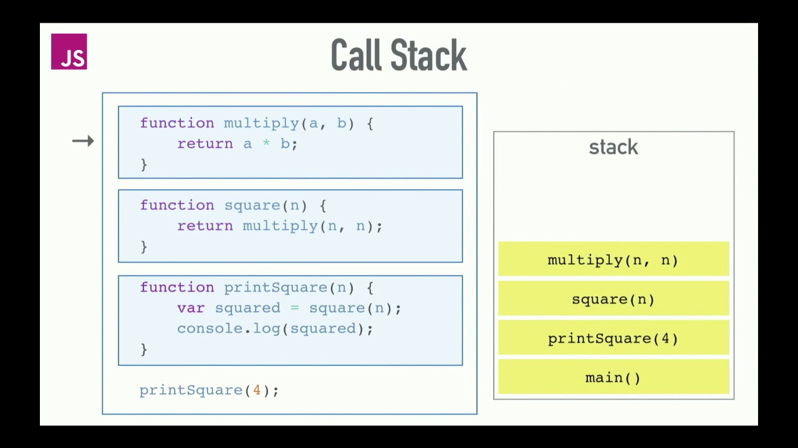
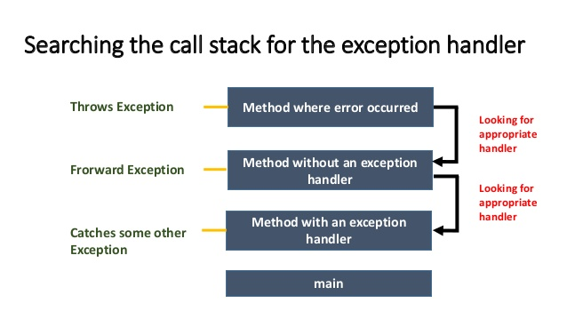
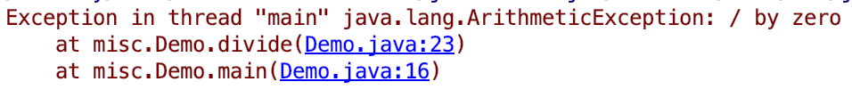

# Lecture 13
#java course#

## Exceptions

Често в една програма, могат да настъпят грешки (изключения), породени от една или друга причина.
За да бъде надежден софтуера, който пишем програмата трябва да е способна да се оправя в такива моменти.

Един такъв пример е, когато искаме потребителя да въведе число, но той въвежда текст. Това е неучакван входен параметър
за програмата и е тя трябва да може да се справи с този проблем.

В езици като `C` това дали една функция е завършила успешно (без грешки) се индикира от резултата,
който тази функция връща. Ако резултата на функцията е `0` това означава че е изпълнена без грешки, ако е някое 
друго число то би означавало че е настъпила грешка. Като различните видове грешки се репрезентират с различни числа.

- Пример

```c
/* Divided By zero Error i.e. Exception*/

#include <stdio.h>
#include <stdlib.h>

void main() {
   int divided = 60;
   int divisor = 0;
   int quotient;

   if( divisor == 0){
      fprintf(stderr, "Division by zero! Exiting...\n");
      getch();
      exit(-1); /* програмата завърши с грешка */
   }
   
   quotient = divided / divisor;
   fprintf(stdout, "Value of quotient : %d\n", quotient);
   getch();
   exit(0); /* програмата приключи успешно */
}
```

`Java` има по-различен подход за моделиране на грешки. За разлика от `C`, грешката е нещо което може да прекъсне
изпълнението на програмата във всеки един момент от време.  
Термина, който се използва за това е *да се хвърли грешка*.  
Или може да мислете за **Exceptions**, като събития настъпващи в програмата, които нарушават нормалното и изпълнение.

Грешките, като всичко останало в `Java` са обекти. Като специфичното при този тип обекти, е че те могат да 
бъдят *хвърляни* използвайки ключовата дума `throw`.

- Пример

```java
public static void main(String[] args) {

    int divided = 60;
    int divisor = 0;
    int quotient;

    if (divisor == 0) {
        System.err.printf("Division by zero! Exiting...%n");
        throw new ArithmeticException(); // хвърляме грешка
    }

    quotient = divided / divisor;

    System.out.printf("Value of quotient : %d%n", quotient);
}
```

### Как работят Exceptions

В предишните лекции разглеждахме структората от данни `Stack` и това как тя се използва за да се описва,
кой метод след кой е извикван, какви параметри са подадени на тези методи и кой е текущия метод за изпълнение.  
Ако в някой от тези методи настъпи грешка то изпълнението на този метод се прекъсва и `Java` започва да търси място
в кода, било то в текущия метод или някой от предишните, където тази грешка да може да бъде обработена.

Това търсене на код способен да обработи грешката също така може да се назове, като:  
*Търсене на **Error Handler** от **Runtime**-a на `Java`*.
 


> Редът на изпълнение е &rarr; `main()` &rarr; `printSquare(4)` &rarr; `square(4)` &rarr; `multiply(4, 4)`,
като `main()` първи е влязъл в Stack



В примера по-горе, ако настъпи грешка в `multply(...)`, първо ще се потърси там за **Error Handling**,
ако не бъде намерен ще се потърси в `square(...)`, ако и там не бъде намерен ще се потърси още един метод назад в 
`printSquare(...)` и така, докато не бъде изпразнен целия `Stack`. Ако и в главния метод `main`, няма **Error Handling**,
то тогава няма никъде код в програмата, способен да обработи тази грешка и програмата ще приключи с необработена грешка.

### Stack Trace

**Stack Trace** се състои от детайлна информация за това, какъв тип грешка е настъпла
и каква е поредицата от методи породили тази грешка.

За да се проследи, от кой метод е започнала грешката четенето на Stack Trace трябва да започне от долу на горе.



> Грешката е започнала от метод `main` на 16-ти ред в класът `Demo`. 
Като мястото, където е хвърлена е в метод `divide` на 23-ти ред в класът `Demo`.
Типът на грешката е `ArtihhmeticException`, като съобщението е `/ by zero`.

### try-catch

За да индикираме в програмата, че при изпълнението на дадено парче код може да настъпи грешка 
ние трябва да използваме `try block`. Това би означавало, че ние очакваме в блока, който е обхвант от `try`, 
очакваме да настъпи грешка.

- Пример

```java
try {
    int quotient = 60 / 0;
}
```

> Този пример няма да компилира, защото не можем да имаме `try` без `catch` или `finally`.


За да напишем, кода способен да обработи грешката **Error Handling**, ще трябва да използваме `catch block`.
Като в този блок ще напишем логиката, за това как да обработим грешката.

- Пример

```java
try {
    int quotient = 60 / 0;
} catch (Exception e) {
    // error handling (логика за обработване на грешката)
    System.out.println("Can't divide by zero");
}
```

Забележете `catch` блокът приема параметър `Exception e`. Този параметър е грешката, която е била уловена.
Кодът, който е написан в `catch` блока ще бъде изпълнен само, когато бъде хвърлена грешка от кода който е в `try` блока.
Ако не бъде хвърлена грешка програмата ще продължи да изпълнява кодът намиращ се след целия **try-catch**.


Теоретично можем да слагаме **try-catch** навсякъде и така бихме предотвратили в програмата да настъпват грешки.
Но това не би било практично. Добра практика е когато очакваме грешка и я уловим да я обработим, преди да продължим
с изпълнението на програмата.

#### Множество catch блокове

Казахме че `catch` блока приема параметър, като първо се упоменава типът на грешката а след това името на променливата.  
Възможно е след един `try` да последват множество `catch` блокове, като всеки `catch` блок може да улавя различен тип
грешки.

- Пример

```java
String numberAsText = "44.5";

try {
    double value = Double.parseDouble(numberAsText);

    double quotient = value / 0;
} catch (NumberFormatException nfe) {
    
    System.out.println("Не може да бъде преобразуван текста в число.");
} catch (ArithmeticException ae) {
    
    System.out.println("Деление на 0 не е позволено.");
}
```

> Имаме два `catch` блока. Единия хваща грешки от типът `NumberFormatException`, а другия `ArithmeticException`.

ℹ️ За допълнителна информация относно **try-catch** вижте това [youtube видео](https://www.youtube.com/watch?v=JTjeGpSUL2M).

#### finally блок

В Java има концепцията за блок (пърче от код), който може да бъде изпълняван винаги, независимо дали е настъпила
грешка или не. Това са `finally` блоковете. Той върви ръка за ръка с `try` блока.


- Пример

```java
try {
    double quotient = value / 0;
} finally {
    System.out.println("Този блок винаги ще се изпълни");
}
```

> Независимо дали делението е успешно или не `finally` блока ще се изпълни след това.

`finally` блока също може да бъде използван заедно с `catch` клауза.

- Пример

```java
try {
    System.out.println("1");
    throw new NullPointerException();
    System.out.println("2");
    
} catch (NullPointerException e) {
    System.out.println("3");
    
} finally {
    System.out.println("4");   
}
```

> Примера по-горе ще принтира цифрите в следния ред 1 &rarr; 3  &rarr; 4. Няма да се принтира 2 защото преди това
се хвърля `NullPointerException`.

Практически `finally` блока намира приложение, там където знаем че може да настъпи грешка и искаме да гарантираме,
че след настъпването на тази грешка (независимо дали е хваната с `catch`) ще се изпълни някакво парче код,
което ще се погрижи да зачисти, каквото е останало преди настъпването на грешката.  

Такъв пример, е когато се осъществява някакъв вид комуникация м/у различни сървъри. При настъпването на грешка искаме
да се погрижим успешно да прекратим комуникацията за да си спестим хабенето на излишни ресурси.

### Видове Exceptions

Вече споменахме, че грешките в Java са обекти (класове). Това означава че те могат да бъдат наследявани и да има 
йерархия в грешките. Всички грешки имат общ наследник, който е `Throwable`.

 

- `Throwable` - Това е общия наследник на всички видове грешки (exceptions), които могат да бъдат хвърлени (и хванати)
използвайки **try-catch**.

- `Error` - Това са видове грешки, които могат да бъдат разглеждани, като фатални. Те са предназначени да бъдат
хвърляни от **JVM** и обикновенно няма смисъл да бъдат хващани, тъй като ако са хвърлени приложението ще се намира 
в състояние, от което трудно ще може да се възстанови. Такива случаи са например, ако свърши паметта
`OutOfMemoryError` или `StackOverflowError`. Недейте, да хващате такива грешки.

- `RuntimeException` - Това са грешки, които основно са предназначени да бъдат ползвани от програмисти, сигнализирайки,
че е настъпил проблем по време на изпълнение на програмата, от който обикновенно програмата може да се възстанови. 
Такива например са `ArithmeticException`, `NullPointerException`, `ArrayIndexOutOfBoundsException` и други.

В `Java` грешките се делят на два типа **checked (проверени)** и **unchecked (непроверени)**.

- **checked** - Това са тези грешки, които компилатора ще ни задължи да обработим. Ако някъде в кода имаме случай,
който хвърля **checked exception**, то този който извиква това парче код, ще е длъжен да го обвие в **try-catch**.  
За да бъде един exception **checked**, той трябва да наследява класът `Exception` 
(това е десния клон в йерархията по-горе).

    - Пример
    
    ```java
    import java.io.IOException;
    
    public class Main {
    
        public static void main(String[] args) {
            foo(); // не е нужно да имаме try-catch тука защото това е свършено във foo метода
        }
    
        private static void foo() {
            try {
                throw new IOException();
            } catch (IOException e) {
                // длъжни сме да сложим catch защото IOException е checked exception
            }
        }
    }
    ```

- Има вариант, при който не сме длъжни да слагаме **try-catch** блок, когато се хвърля **checked exception**.
За целта обаче трябва методът, който хвърля този exception изрично да упоменава в сигнатурата си, че може да бъде
хвърлен exception.

    - Пример
    
    ```java
    import java.io.IOException;
    
    public class Main {
    
        public static void main(String[] args) {
            try {
                foo();
            } catch (IOException e) {
                // Длъжни сме да имаме catch клауза, защото foo метода хвърля checked IOException
            }
        }
    
        /**
         * Не е нужно да имаме try-catch тука защото метода упоменава в сигнатурата си
         * чрез throws IOException че хвърля checked exception.
         */
        private static void foo() throws IOException {
            throw new IOException();
        }
    }
    ```

- **unchecked** - Това са тези грешки, които не сме длъжни да увладяваме (да има **catch** клауза). Често тези грешки се
наричат runtime грешки (т.е грешки, които възникват по време на изпълненеие на програмата).  
За да бъде един exception **unchecked**, то той трябва да наследява класът `Error` или `RuntimeException`.

    - Пример
    
    ```java
    public class Main {
    
        public static void main(String[] args) {
            foo(); // не е нужно да имаме try-catch, защото NullPointerException е checked exception
        }
    
        /**
         * Не е нужно да имаме try-catch, нито throws NullPointerException,
         * защото този exception e unchecked.
         */
        private static void foo() {
            throw new NullPointerException();
        }
    }
    ```

### Създаване на `Exception`

В Java стандартната библиотека има набор от грешки, които можем да използваме. Всяка една от тях цели да моделира
определен тип грешка. Например `ArithmeticException` моделира грешки свързани с аритметични операции, докато
`NullPointerException` моделира грешка, която настъпва при погрешно менижиране на обекти и референции, които не 
са инстанцирани.

Често се налага да създадем собствен вид грешка, която моделира нещо специфично за приложението, което ние разработваме.  
Това може да стане, като наследим някой от типовете грешки, от йерархията по-горе.

Вече казахме, че грешките от тип `Error`, са предназначени по-скоро за употребта от JVM. За това най-често се
наследява `RuntimeException`, за да създадем **unchecked exception** или `Exception` за **checked exception**.

Веднъж наследили, някой от класовете за грешка, ние можем да изплзваме ключовата дума `throw`, за да хвърляме 
тази грешка.

- Пример

```java
public class MyCustomException extends RuntimeException {

}
```

```java
public static void main(String[] args){
  throw new MyCustomException(); // инстанцираме грешката с new и я хвърляме с throw
}
```

Когато наследяваме една грешка, ние можем да използваме конструкторите, които са дефинирани в супер класът.

- Пример

```java
public class MyCustomException extends RuntimeException {

    /**
     * Default конструктор.
     */
    public MyCustomException() {
    }

    /**
     * Конструктор със съобщение.
     *
     * @param message съобщението, което ще бъде върнато от {@link #getMessage()}.
     */
    public MyCustomException(String message) {
        super(message);
    }

    /**
     * Конструктор със съобщение и грешка.
     *
     * @param message съобщението, което ще бъде върнато от {@link #getMessage()}.
     * @param cause   грешката, която е породила тази грешка.
     */
    public MyCustomException(String message, Throwable cause) {
        super(message, cause);
    }
}
```


#### Какви методи има класът `Throwable`?

Всеки един exception наследява класът `Throwable`, от който той получава набор от методи 
и конструктори на разположение.

- метод `getMessage()` - Това е метод, който връща `String` репрезентиращ детайлна грешка. Текстът, който
се връща от този метод често се използва да се логне (принтира), съобщението на грешката, когато тя е уловена.

- метод `getCause()` - Този метод връща `Throwable`. Често една грешка, може да бъде причинена от друга грешка,
или да бъде обвита в друга грешка. Този метод ще върне първоначалната грешка, ако има такава.

- метод `printStackTrace()` - Този метод ще принтира [stack trace](#stack-trace), илюстрирайки, 
къде е настъпила грешката.

#### Хващане на една грешка и хвърляне на друга (rethrowing)

Има ситуации, където бихме искали да прихванем някаква грешка, и да я транслираме в друга по-подходяща.

Да кажем че се опитваме да направим заявка до база данни за да намерим конкретен потребител. Ако заявката се провали
може да се хвърли `SQLException`. Ние можем да прихванем тази грешка и вместо нея да хвърлим `UserNotFoundException`.
Така грешката става по-говорима и по-лесно се разбира къде и какво точно се е счупило.

- Пример

```java

public static void main(String[] args){
  
    User user = findUser("1234");
}

private static User findUser(String id) {
    try {
        // логика която може да хвърли SQLException
    } catch (SQLException e) {
        throw UserNotFoundException("User with id: " + id +" was not found.", e);  
    }
}
```

Често този подход се използва да се обвият грешки, които са **checked** в такива, които са **unchecked**.
Така клиента на този код, не е длъжен да пише **try-catch**.


> Не прекалявайте със **try-catch**. Тези клаузи трябва да се използват там, където има логически смисъл.
Код, който няма възможност да хвърли грешка, няма смисъл да бъде в **try-catch**. 

ℹ️ За повече информация относно **Exceptions** в Java вижте това [youtube видео](https://www.youtube.com/watch?v=EWj60p8esD0). 

## Tasks

### Task 1

Напишете програма, която взема от потребителя, като входен параметър число.
Въведеното число да бъде принтирано на конзолата.

Ако потребителя въведе текст или невалидно число, тогава да се изпише съобщение за грешка.

> Използвайте `Double.parseDouble(scanner.nextLine())`, за да конвертирате текста в число от тип `Double`.

<br/><details><summary><b>Solution</b> 👀</summary> 
<p>

```java
Scanner scanner = new Scanner(System.in);

try {
    String text = scanner.nextLine();

    System.out.print("Въведете число: ");
    double number = Double.parseDouble(text);

    System.out.println("Вие въведохте " + number);
} catch (NumberFormatException e) {
    System.out.println("Въведеното от вас число е невалидно");
}
```

</p>
</details>

### Task 2

Напишете програма, която взема от потребителя 5 числа и принтира сумата им.

Ако потребителя не въведе число, тогава да той да бъде помолен отново да въведе число.
Програмата приключва, когато са въведени точно 5 валидни числа и се принтира тяхната сума.

> Използвайте `Double.parseDouble(scanner.nextLine())`, за да конвертирате текста в число от тип `Double`.

<br/><details><summary><b>Solution</b> 👀</summary> 
<p>

```java
Scanner scanner = new Scanner(System.in);

double sum = 0;
int count = 0;

while (count < 5) {

    try {
        String text = scanner.nextLine();

        System.out.print("Въведете число: ");
        double number = Double.parseDouble(text);

        sum += number;
        count++;

    } catch (NumberFormatException e) {
        System.out.println("Въведеното от вас число е невалидно");
    }
}

System.out.println("Сумата от 5-те числа е: " + sum);
```

</p>
</details>
